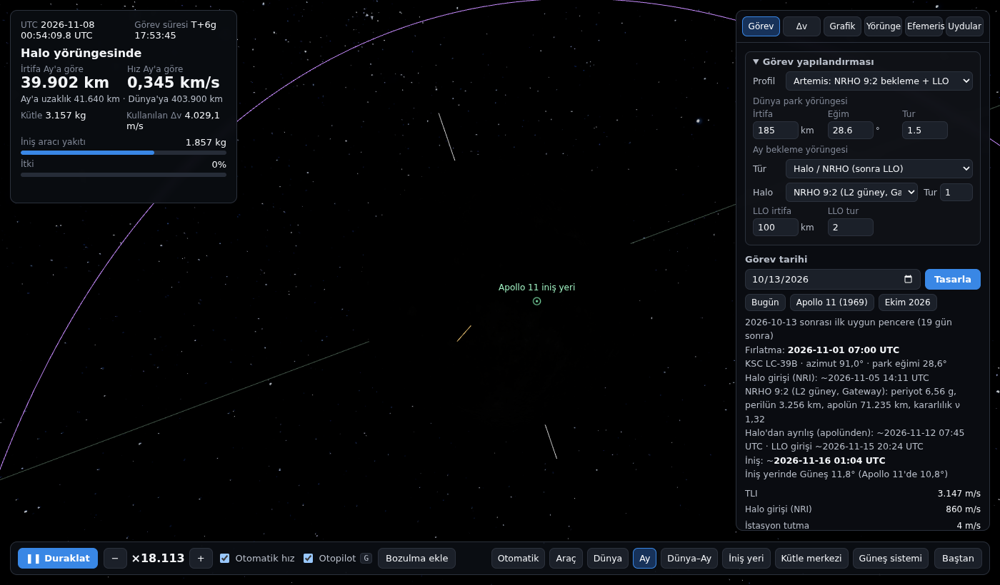
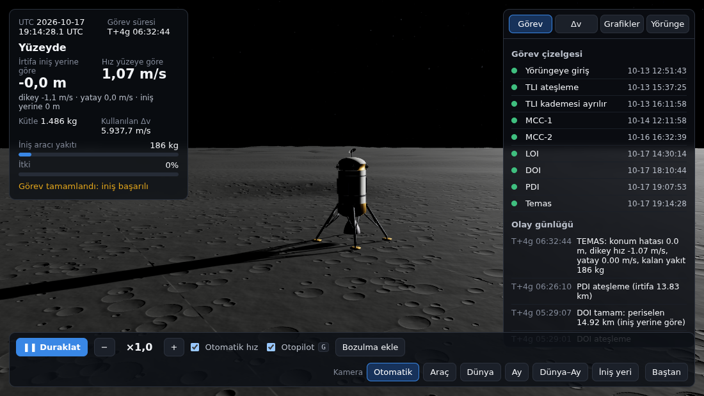

# ROCSIM — Dünya'dan Ay'a canlı görev simülasyonu

Dünya park yörüngesinden Apollo 11 iniş bölgesine (Sükûnet Denizi) kadar tüm görevi tarayıcıda, gerçek zamanlı çalışan bir fizik motoruyla uçuran simülasyon. Güneş sistemi canlı N-cisim efemerisiyle hesaplanır, görev her tarih için yeniden tasarlanır, Dünya ve Ay çevresindeki gerçek uydular canlı gösterilir.

*A browser-based, real-time Earth-to-Moon mission simulator: live N-body ephemeris (DE440-initialised), modular trajectory design (LLO or halo/NRHO staging), closed-loop autopilot down to touchdown at the Apollo 11 site, and ~16,600 live satellites (CelesTrak + SGP4, JPL Horizons).*


| | |
|---|---|
|  |  |
|  | |

## Özellikler

- **Fizik motoru:** Dünya J2 + presesyon/nütasyon (IAU 2006/2000A), Ay J2/C22, Güneş/Ay/Dünya üçüncü cisim etkileri, DOPRI5 integratör, sonlu itki, kademe ayrılması.
- **Canlı efemeris:** JPL DE440s çekirdeğiyle başlatılan N-cisim entegrasyonu, Ay yönelimi (moon_pa_de440), Dünya yönelim parametreleri.
- **Modüler görev tasarımı:** Dünya park yörüngesi (irtifa, eğim, tur) ve Ay bekleme yörüngesi seçilebilir.
  - Alçak Ay yörüngesi (LLO): irtifa ve tur sayısı ayarlanabilir.
  - Halo: Artemis NRHO 9:2, L2 güney halo, L1 kuzey halo. CR3BP'de Richardson + diferansiyel düzeltme, ardından Dünya+Ay+Güneş+Ay J2/C22 modelinde çoklu atışla tarihe taşıma.
  - KSC fırlatma fazlaması, TLI, halo'dan LLO'ya iki yakışlı transfer (Lambert + tam model atış), J2 nodal presesyon düzeltmesi, Δv bütçesinden araç boyutlandırma.
- **Otopilot:** TLI, rota düzeltmeleri (MCC), LOI ya da halo girişi + istasyon tutma + ayrılış, DOI, PDI 3B güdüm ve temas. Elle uçuş da mümkün.
- **Canlı uydular:** CelesTrak aktif uydular (~16.600) SGP4 ile ayrı iş parçacığında; Ay çevresinde LRO, Danuri, Chandrayaan-2, ARTEMIS P1/P2, CAPSTONE (JPL Horizons).
- **Etkileşim:** uydu ve gezegenlere tıklayınca bilgi kartı, "Kamerayla izle" odak kamerası, 8 kamera modu, görev çizelgesinden ileri sarma, profil karşılaştırma tablosu.

### Örnek sonuçlar (13 Ekim 2026, tüm profiller temasla biter)

| Profil | Toplam Δv | Süre |
|---|---|---|
| Apollo hızlı (LLO 2 tur) | 5937,8 m/s | 4,3 gün |
| Apollo 11 gibi (LLO 13 tur) | 5937,8 m/s | 5,1 gün |
| Artemis NRHO 9:2 | 6686,1 m/s | 14,8 gün |
| L1 halo | 6499,2 m/s | — |
| L2 halo | 7025,1 m/s | — |

## Çalıştırma

Gereken: Python 3 (yalnız standart kütüphane) ve güncel bir tarayıcı.

```bash
cd web
python3 sunucu.py          # macOS'ta baslat.command'a çift tıklamak da olur
# tarayıcıda: http://localhost:8765
```

`sunucu.py` sitenin dosyalarını sunar ve CelesTrak / JPL Horizons verileri için yerel vekil ve önbellek görevi görür. Adres parametreleri: `?date=1969-07-16`, `?profile=NRHO` (APOLLO, APOLLO11, NRHO, L2, L1), `?sats=0`. Ayrıntılar: [web/BENIOKU.md](web/BENIOKU.md).

Testler (Node 18+):

```bash
cd web
node test/test_kernel.js
node test/test_cr3bp.js
node test/test_profiles.js     # tüm profilleri tasarlayıp uçurur (birkaç dakika)
node test/make_designs.js      # data/designs_default.json'ı yeniden üretir
```

## Klasörler

| Yol | İçerik |
|---|---|
| `web/` | Tarayıcı simülasyonu (Three.js, Web Worker'lar), `sunucu.py`, testler |
| `web/js/` | `engine.js` fizik · `ephem.js`/`live.js` efemeris · `cr3bp.js`/`halo.js` halo yörüngeleri · `design.js` görev tasarımı · `mission.js` otopilot · `sats.js`/`satlayer.js` uydular · `scene.js`/`ui.js` görüntü ve arayüz |
| `scripts/` | Blender sürümü (Adım 1–5): görev motoru ve sahne betikleri |
| `kernels/` | JPL DE440s, Ay yönelim çekirdeği, efemeris tablosu |
| `pylib/` | Blender içinde kullanılan jplephem |
| `renders/` | Blender render örnekleri |

Blender sahne dosyası (`ROCSIM.blend`, ~150 MB) GitHub dosya sınırını aştığı için depoda yoktur.

## Veri kaynakları ve lisanslar

- Kod: MIT (bkz. [LICENSE](LICENSE)).
- JPL DE440s ve Ay yönelim çekirdekleri: NASA/JPL NAIF.
- Canlı uydu verisi: [CelesTrak](https://celestrak.org) GP verisi, [JPL Horizons](https://ssd.jpl.nasa.gov/horizons/).
- Gezegen dokuları: [Solar System Scope](https://www.solarsystemscope.com/textures/) (CC BY 4.0); Ay rengi ve yükseklik: NASA SVS CGI Moon Kit (LROC/LOLA).
- Kütüphaneler: [three.js](https://threejs.org) (MIT), [satellite.js](https://github.com/shashwatak/satellite-js) (MIT), jplephem (MIT).
