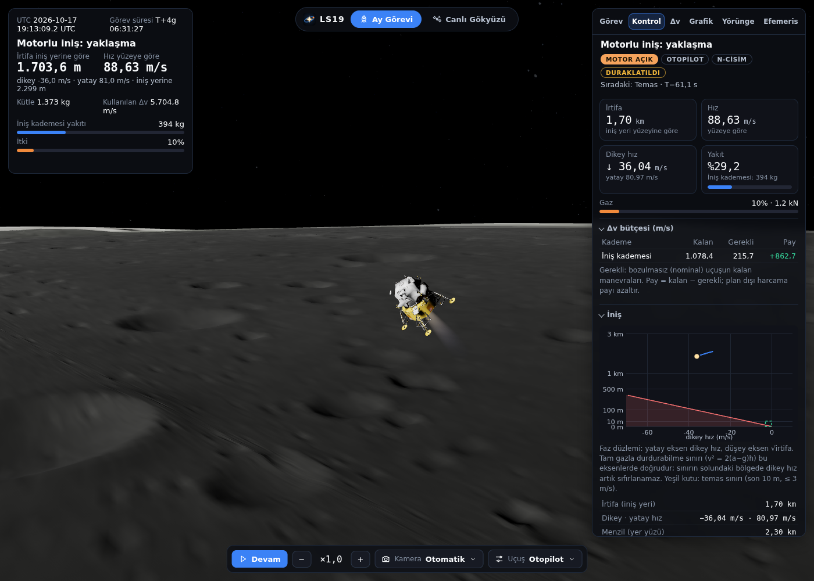
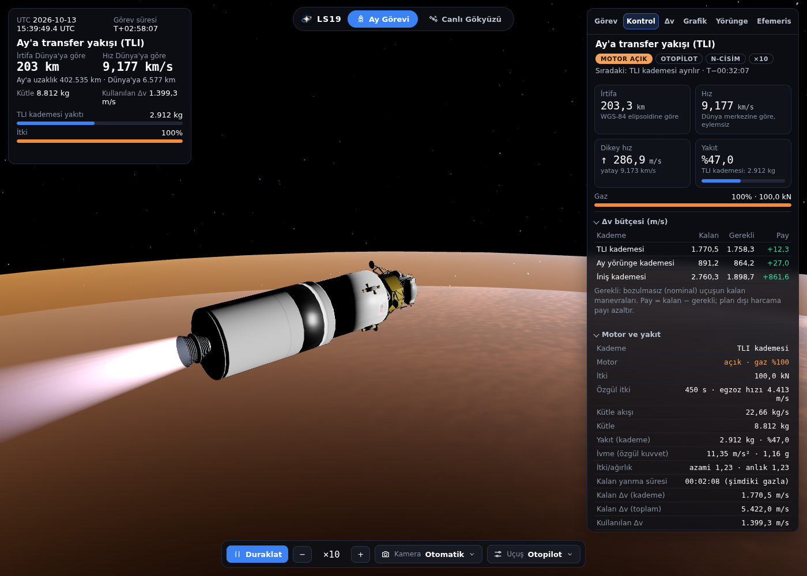
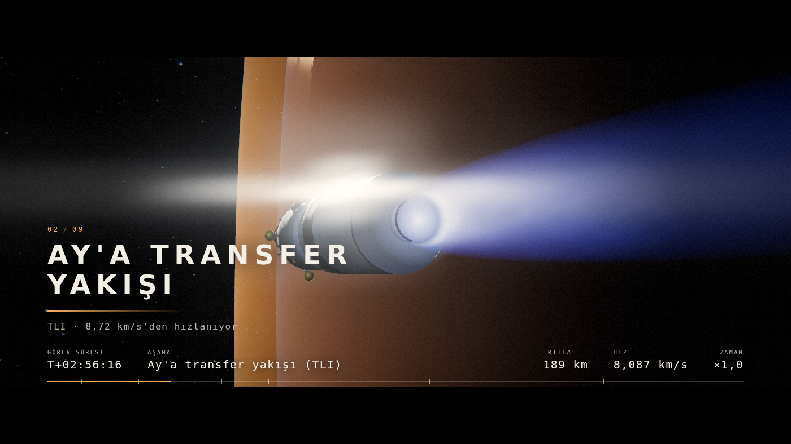
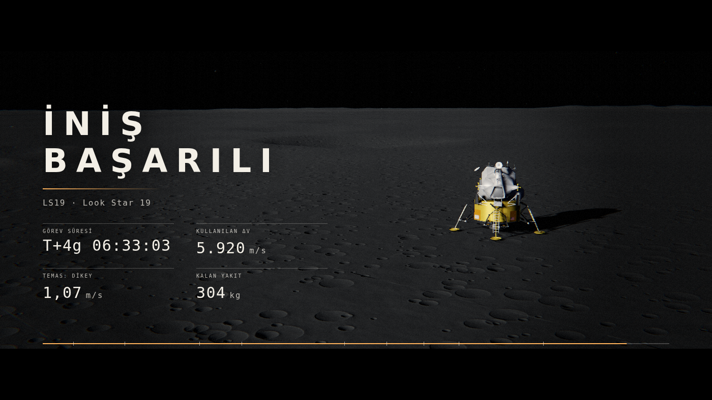

# LS19 · Look Star 19

Tarayıcıda gerçek zamanlı çalışan bir uzay simülasyonu. Dünya park yörüngesinden Apollo 11 iniş bölgesine kadar tüm Ay görevini fizik motoruyla uçurur: motorlu iniş isteğe bağlı olarak **yakıt-optimal güdümle** (kayıpsız dışbükeyleştirme + ikinci derece koni programı, tarayıcıda WebAssembly çözücüyle) ve **iki kademeli iniş aracıyla** yapılır, aracın yönelimi **6 serbestlik dereceli rijit cisim dinamiğiyle** (RCS + gimbal) uçurulur, araç NASA'nın **resmî Apollo modelleriyle** (LM, hizmet modülü, S-IVB) çizilir, aracın anlık durumu canlı **kontrol panelinde** izlenir. Güneş sistemini canlı N-cisim efemerisiyle hesaplar, Dünya ve Ay çevresindeki gerçek uyduları ve ~53.000 asteroidi canlı gösterir. Saptırma laboratuvarında bir asteroide uygulanan itkinin Dünya yakın geçişini ne kadar değiştirdiğini hesaplar.

*A real-time, browser-based space simulator: live N-body ephemeris (DE440-initialised), an Earth-to-Moon mission with LLO/halo/NRHO staging flown by a closed-loop autopilot (optional fuel-optimal powered descent via lossless convexification and second-order cone programming, re-solved every 10 s with a WebAssembly interior-point solver; one- or two-stage lander; rigid-body 6-DOF attitude dynamics with RCS and thrust-vector control; vehicle drawn with NASA's official Apollo models (LM, service module, S-IVB); live flight-telemetry control panel), ~16,600 live satellites (CelesTrak + SGP4), ~53,000 asteroids (JPL SBDB), and an asteroid-deflection physics engine (kinetic impactor or continuous force, B-plane analysis, validated against JPL close-approach data).*


| | |
|---|---|
|  |  |
|  |  |



*Dengeli yakıt-optimal motorlu iniş (iki kademeli araç, Apollo 11 iniş yeri): yörünge kademesi atılmış, iniş kademesi NASA'nın Apollo LM modeliyle yaklaşmada (%10 gaz); sağda Kontrol sekmesi.*



*TLI yakışı: NASA'nın resmî Apollo modelleriyle araç yığını (üstten alta iniş aracı LM, hizmet modülü, Saturn V S-IVB); sağda Kontrol sekmesi.*



*Sinematik gösterim (alt çubukta film simgesi ya da `C`): TLI ateşlemesinden bir kare. Letterbox, bölüm kartı, veri şeridi ve zaman çizelgesi; HDR bloom, anamorfik parlama ve film geçişi; vakum plümü, Dünya'dan yansıyan mavi dolgu ışığı. Her kare gerçek simülasyondur.*



*Gösterimin kapanışı: iniş özeti (görev süresi, kullanılan Δv, temas hızı, kalan yakıt; sayılar kart açılırken sıfırdan yuvarlanır) solda, yüzeydeki iniş aracı ve gölgesi sağda. Temas çekiminde iniş motorunun yüzeyi vurduğu yerde Ay tozu (balistik parçacıklar) kalkar.*

## Özellikler

- **Ay görevi:** KSC fırlatma fazlaması, park yörüngesi, isteğe bağlı **park yörüngesinde enerji yükseltme**, TLI, rota düzeltmeleri, LOI ya da halo/NRHO girişi, istasyon tutma, LLO, DOI, motorlu iniş ve temas — otopilotla ya da elle. Dünya park yörüngesi ve Ay bekleme yörüngesi seçilebilir; tasarım her seçim için en az Δv'li yolu kurar.
- **Park yörüngesinde enerji yükseltme (Chandrayaan / Artemis tarzı):** Görev yapılandırmasında *Yükseltme yakışı* (0–4) ve *Son apoje* (km) verilirse araç park yörüngesinden doğrudan TLI'ya gitmez; önce her biri perijede ortalı, tam itkılı sonlu **apoje yükseltme yakışlarıyla** yüksek bir elipse çıkar (enerji eşit adımlarla artar), TLI bu elipsin perijesinde yapılır. Tasarım zinciri TLI'dan geriye doğru çözer (tam model: J2 + Ay + Güneş): her yakışın süresi, yakış öncesi yörüngenin apojesi hedefe eşit olacak biçimde değişken kütleli itkiyle geriye entegre edilir; ilk yakış park yörüngesini dairesel yapar (süre + küçük eğim). Otopilot ilk yakışı tasarım anında yapar, sonrakileri **aracın kendi perijesine göre** ortalar ve yakış süresini ateşlemede gerçek durumdan hedef apojeye göre çözer; TLI de yüksek elipsin perijesine göre ateşlenir — böylece park/yükseltme sırasındaki hız bozulmaları zamanlamayı kaydırıp TLI'yı bozmaz (park ve yükseltme sırasında 1–10 m/s bozulmalarda 15/15 iniş başarılı; MCC-1 çoğunlukla 8–16 m/s, en kötü durumda 58 m/s). Yüksek elipste Ay ve Güneş bozucuları belirginleşir; hepsi N-cisim çözücüyle hesaplanır. Toplam Δv doğrudan TLI'dan yalnız birkaç m/s farklıdır (yükseltme + TLI ≈ 3148 m/s; yakış kayıpları daha kısa yakışlarda azalır). Hazır profil: *Yörünge yükseltmeli: 3 yakış (apoje 40.000 km) + LLO*; halo/NRHO profilleriyle de birleşir.
- **N-cisim çözücü:** Araç, Dünya, Ay ve Güneş'in (canlı efemeriste gezegenlerin) çekimiyle tek eylemsiz çerçevede ilerler; **etki küresi geçişi yoktur** (Dünya J2 her yerde, Ay J2/C22 Ay'ın 150.000 km yakınında). Üçüncü cisimler dolaylı terimleriyle alınır; bu, uzay aracının barisentrik N-cisim hareket denklemiyle eşdeğerdir ve motordan bağımsız yazılmış barisentrik-tutarlı bir N-cisim entegrasyonuyla (`web/test/nbody_ref.js`) **20 sa / 52 sa / 22 sa'lik transfer bacaklarında 0,06–0,17 m, alçak Ay yörüngesinde 1,4 cm** uyuşur. Eski iki merkez cisimli (etki küresi) çözücü de seçilebilir (Uçuş ▾ → *N-cisim çözücü*; uçuş sırasında değiştirilebilir, durum kesin dönüştürülür); iki çözücüyle tüm görev ≤ 0,001 m/s Δv farkıyla aynı sonucu verir. **Yörünge** sekmesinde canlı **kuvvet dökümü** (Dünya, Ay, Güneş, gezegenler, Dünya J2, Ay J2/C22, itki; m/s²) baskın cismi ve her etkinin doğrudan çekimini ile bozucu (gelgit) etkisini gösterir — örn. Güneş doğrudan ~6·10⁻³ m/s² çeker ama Dünya'yla birlikte düştüğünden etkisi ~5·10⁻⁷ kalır.
- **Değişken kütleli sonlu itki:** itki ivmesi her DOPRI aşamasında o aşamanın kütlesiyle (m₀ − ṁ·Δt) hesaplanır; uygulanan Δv roket denklemine uyar (önceden adım başı kütle kullanıldığından TLI'da Δv %0,14 ≈ 4,3 m/s eksik uygulanıyordu; bu hata düzeltildi).
- **Kontrol paneli (canlı uçuş telemetrisi):** Ay Görevi panelinin **Kontrol** sekmesi (ya da `K`) aracın anlık durumunu canlı gösterir. *Motor ve yakıt:* gaz, itki, kütle akışı ṁ = F/(Isp·g₀), özgül kuvvet (yerçekimi dışı ivme, g), itki/ağırlık, kalan yanma süresi, Tsiolkovsky ile kalan Δv. *Konum ve hız:* Dünya'da WGS-84 elipsoidine göre **jeodezik irtifa**, Ay'da ortalama yarıçap ve iniş yeri yüzeyine göre irtifa; enlem/boylam; eylemsiz ve **dönen yüzeye göre** hız (v − ω×r), dikey/yatay hız, uçuş yolu açısı, yön. *Yörünge:* osküle elemanlar (a, e, i, Ω, ω, ν), periapsis/apoapsis irtifası ve **o noktalara kalan süre** (Kepler denklemi), özgül enerji, v∞, yörünge haritası; "koniğin geçerliliği" üçüncü cisim bozucusunun merkezi çekime oranını gösterir (transferde periapsis yaklaşıktır, dürüstçe işaretlenir). *Δv bütçesi:* her kademenin kalan Δv'si − planlı manevralarının kalanı = **pay**; bozulmasız uçuşta sabit kalır, plan dışı harcama onu azaltır. *İniş:* iniş yeri irtifası, menzil, motor kesilirse çarpmaya kalan süre, tam gazla **durma yüksekliği** v²/2(a−g), askıda kalma gazı, yüzeye göre hız sıfırlama alt sınırı ve dikey hız–√irtifa **faz düzlemi** grafiği. *Ortam:* Dünya uzaklığı ve ışık gecikmesi, Dünya ile görüş hattı (Ay engeli), Güneş ışığı oranı (Dünya ve Ay diskleriyle örtülme). Tüm değerler tek bir saf modülde (`web/js/telemetry.js`) motorun durumundan hesaplanır; panelde satırın üzerine gelince tanımı ve formülü yazar. Uyarılar fiziksel eşiklere dayanır: Δv yetersiz ya da plan dışı harcama, yörünge yüzeyi kesiyor (koniğin hatası delme derinliğinden küçükse), Dünya atmosferine giriş yörüngesi, sert temas riski, durma yüksekliğinin altı, itki/ağırlık < 1, Dünya ile görüş hattı ve gölge bilgisi.
- **Optimal iniş güdümü (Açıkmeşe tarzı):** Motorlu iniş istenirse ZEM/ZEV yerine **yakıt-optimal güdümle** uçurulur: PDI'da, merkezi çekim altında, itki sınırları (en küçük kısma ve %90 azami itki), iniş yeri yüzeyi, son dakikalarda itki yönü sınırı ve iniş/yatay hız koridoru kısıtlarıyla yakıt en aza indirilir. Problem **kayıpsız dışbükeyleştirme** (z = ln m, u = T/m, σ = Γ/m; itki alt sınırı ikinci derece koni olarak gevşetilir, [Açıkmeşe & Ploen 2007](https://doi.org/10.2514/1.27553), [Açıkmeşe, Carson & Blackmore 2013](https://doi.org/10.1109/TCST.2012.2237346)) ile **ikinci derece koni programına (SOCP)** çevrilir ve Clarabel (WebAssembly) ile çözülür; son zaman altın oran araması, ardışık yaklaşım ve çekim yinelemesiyle bulunur (`web/js/pdg.js`). Plan eylemsiz Ay çerçevesinde kurulur, her 10 s'de (son dakikada 4 s) sıcak başlangıçla yeniden çözülür (~50 ms), 120 m'lik kapıdan sonra son iniş yasası temasa taşır. **Uçuş ▾ → İniş güdümü:** *Optimal (dengeli)* (itki dikeyden ≤ 45°; son 60 s'den itibaren koni 20 s kalana dek yumuşakça ≤ 20°'ye daralır ve kapıya dek orada kalır; hız koridoru; komut sürekli, yönelim izleyebilsin diye), *Optimal (serbest)* (işaretleme sınırı yok, gevşek koridor; saf yakıt-optimale en yakın, son ~12 s'de hızla burun indirir) ve eski *ZEM/ZEV*. Apollo profilinde kalan yakıt ZEM/ZEV 190 kg → dengeli 198 kg → serbest 238 kg; sıkı yakıt payı olan NRHO profilinde 60 → 68 → 106 kg. Δv: ZEM/ZEV 1906 m/s, dengeli 1892 (−%0,7), serbest 1809 (−%5,1); yani iyi tasarlanmış bir Apollo profili güvenlik kısıtları altındaki optimuma yakındır, kazanç kısıtlar gevşedikçe büyür (kısıtsız kuramsal en iyi ~1736 m/s, ama son saniyelerde yüzeye yatay sürünme ister). Dengeli ön ayar kazancın bir kısmını yönelimin izleyebileceği yumuşaklığa bırakır (hızlı daralan koni 6 kg daha çok yakıt veriyordu ama yaklaşmada ani dönmelere yol açıyordu). Kaynaklar, formülasyon ve doğrulama düzeyi: [docs/optimal_inis.md](docs/optimal_inis.md).
- **İki kademeli iniş (Ay yörünge kademesi + iniş kademesi):** **Uçuş ▾ → Araç** (varsayılan *İki kademe*; değişince görev yeniden kurulur). İniş aracı iki itki sistemine bölünür: **Ay yörünge kademesi** (380 kg kuru + yörünge Δv'sine yetecek yakıt; MCC, LOI/NRI, istasyon tutma, LLO ve DOI; 16 kN, Isp 320 s) ve **iniş kademesi** (980 kg kuru + kalan yakıt; yalnız motorlu iniş; 12 kN, Isp 325 s). Yörünge kademesi DOI'dan sonra alçalış yayında **15 km irtifada**, PDI'dan 138–282 s önce atılır; ölü kütle (yapı + artan yakıt) motorlu inişe taşınmaz. Toplam kütle, itki ve yörünge kademesinin Isp'si tek kademeli tasarımla aynı tutulur, yani yörünge tasarımı yeniden yapılmaz; yörünge kademesinin yakıtı tasarımın Δv'sinden (+%3 +15 m/s) roket denklemiyle bulunur. Aynı toplam kütleyle temasta kalan yakıt (tek → iki kademe; ZEM/ZEV · dengeli · serbest): Apollo 190 → 302 · 198 → 304 · 238 → 335 kg; NRHO 60 → 155 · 68 → 159 · 106 → 191 kg. Kazancın Apollo'da ~87–100 kg'ı ölü kütlenin atılmasından, yalnız ~10–13 kg'ı iniş kademesinin Isp'sinin (325 s) daha yüksek varsayılmasından gelir: **iyi tasarlanmış bir profilde en büyük kaldıraç güdüm yasası değil kütle düzenidir.** Telemetride planlı PDI manevrası iniş kademesinin Δv bütçesine yazılır. Kademe değerleri temsilidir (belirli bir aracın verisi değildir); kademe değişimi PDI'dan önce yapılır (inişin ortasında kademe değiştiren ortak çok fazlı çözüm yoktur). Ayrıntı: [docs/optimal_inis.md §6](docs/optimal_inis.md).
- **6 serbestlik dereceli araç dinamiği:** Öteleme N-cisim çekiminde nokta kütle olarak ilerler; **dönme gerçek bir rijit cisimdir** (`web/js/rigidbody.js`, `web/js/attctl.js`): Euler denklemleri `I·ω̇ = τ − ω×Iω`, kuaterniyon kinematiği, RK4 (denetim periyodu 0,05 s; TLI yığını 0,1 s). Eylemsizlik tensörü ve kütle merkezi yığının kademelerinden ve yakıt sütunundan **her adım yeniden** hesaplanır (yakıt azaldıkça, kademe atıldıkça değişir). Torku iki aktüatör üretir: ana motorda **gimbal** (±5°, hız ve gecikme sınırlı; kırpma integratörü kütle merkezi ofsetini ve motor sapmasını sıfırlar) ve **RCS** (saf tork çiftleri, darbe sıklığı modülasyonu, en küçük darbe 14 ms; yakıt kuru kütleden düşer, kademe başına 36–60 kg bütçe). Denetleyici itki **vektörünü** komuta çevirir: eldeki açısal ivmeyle durabilecek frenleme eğrisi, hız döngüsü ve jiroskopik terim giderme; itki gerçek (gimbal sapmalı) eksen boyunca uygulanır. Otopilot her yakıştan 180 s önce yakış yönüne hizalanır (ateşlemede yön hatası 0,00°); yakış bitince araç baktığı tarafta kalır (LOI'dan DOI'ya kadar ters yönde: gereksiz 180° taklalar yok), DOI'dan sonra PDI'ya kadar motor ileri kalır; elle uçuşta seçili yön moduna itkisiz de RCS ile dönülür. Ayrılan her kademe **kendi rijit cismidir**: kendi eylemsizliğiyle ve 0,5°/s ayrılma devrilmesiyle torksuz serbest döner (açısal momentum ve enerji korunur), araç da karşı devrilmeyi alır; araç modeli aktif kademeyi gösterir. Sahne yönelimi fizikle aynıdır; alev gimballe döner, RCS iticileri fizikteki görev oranıyla yanar. **Kontrol → Yönelim ve kontrol** satırları kip, itki ekseni hatası, açısal hız, gimbal, tork, RCS görev oranı ve yakıtı, eylemsizlik ve açısal ivme yetkisini canlı gösterir. Doğrulama: korunum yasaları (açısal momentum, enerji), bağımsız kuramlar (simetrik topaç, gravite gradyanı salınım dönemi %0,03), RK4 derecesi 4,01, kaba kuvvetle kütle özellikleri, zaman-eniyi alt sınırın 1,00–1,04 katı eksen kaydırma ve 36 görevin hepsinde yumuşak temas (aşağıda). Tasarım için GitHub'daki benzer 6-DOF projeleri tarandı: [docs/6dof_arastirma.md](docs/6dof_arastirma.md); model, sonuçlar ve sınırlar: [docs/6dof.md](docs/6dof.md). Sınırlar: algılayıcı/kestirim, yakıt çalkantısı, esneklik, itici arızası yoktur; RCS/gimbal değerleri temsilidir; itkisiz süzülmede sınır çevrimi simüle edilmez (yarı-durağan tutma); klasik ZEM/ZEV güdümü yönelim gecikmesinden habersizdir (yaklaşma ve son inişte ±40° salınır, yine yumuşak iner) ve *serbest* mod son ~12 s'de hızla dikeye döner (saf yakıt-optimalin doğası); *dengeli* güdümde ve takla/gimbal düzeltmelerinde yönelim sakindir (aşağıda). Önceki kinematik model (`Mission({ attitude: 'kin' })`) çapraz kontrol olarak korunur; ilk bulgular (360° döngü, ilk kademenin yeniden belirmesi): [docs/yonelim.md](docs/yonelim.md).
- **Akıcı iniş görüntüsü (takla, yönelim sıçramaları, kamera):** Ay yörüngesinde araç artık takla atmaz (LOI ve DOI ters yönde yakıldığından süzülme hep "ileri" idi: araç iki kez gereksiz yarım tur dönüyordu; yakış bitince bakılan taraf korunur). İnişte gimbal girdabı giderildi (düşük gazda gimbal yetkisi küçüktür: tam itkinin %30'unun altında yönelim RCS'ye bırakılır) ve *dengeli* güdümün itki komutu **sürekli** tutulur: işaretleme konisi kalan süreye göre eğim olarak daralır (basamak yok), plan düğümleri arası doğrusal ara değer (FOH), yeni planın ilk düğümü önceki komuttan kesintisiz bağlanır, plandan son iniş yasasına geçiş 4 s'de yumuşatılır. 12 görevde (6 profil × tek/iki kademe) yaklaşma rms |ω| 3,3 → 0,8°/s, itki ekseni hatası 16–38° → 2–5°, komut yönünün adım başına değişimi 28–48° → 0,2–0,8°; Chromium'da gerçek zamanlı kayıtta ekranda >60°/s kare yok. Kamera aracı artık eylemsiz hız yönünden değil yaklaşma ekseninden çerçeveler (yüzeye göre hız sıfıra yaklaşırken arazi sallanmaz), otomatik kamera geçişleri 1,4 s'de yumuşar, alev boyu gaza 0,3 s zaman sabitiyle yaklaşır. Önce/sonra tablosu, nedenler ve kalan davranışlar: [docs/6dof.md §5](docs/6dof.md).
- **Resmî NASA araç modelleri:** Araç, NASA 3D Resources'taki resmî Apollo modellerinden türetilir: iniş aracı *Apollo Lunar Module*, Ay yörünge kademesi *Apollo Soyuz* modelindeki Apollo komuta/hizmet modülünün hizmet modülü (komuta modülü kesilip kapatıldı), TLI kademesi *Saturn V*'in S-IVB'si ve araç aygıt birimi. Modeller `tools/apollo_modelleri.mjs` ile üretilir (Draco açma, düzlemle kesip kapatma, sadeleştirme, WebP + meshopt; üç dosya toplam ~0,7 MB); motor alevi, RCS ve yığın yerleşimi sayıları model dosyasının içinden okunur. Sınırlar: S-IVB'nin J-2 motoru modelde olmadığından aynı modelin ölçeklenmiş F-1 çanı konur; yığın düzeni fizik yığınıdır (gerçek Apollo düzeni değil); görsel boyutlar fizik rollerinden biraz farklıdır. Ayrıntı, lisans ve yeniden üretim: [docs/modeller.md](docs/modeller.md).
- **Sinematik gösterim (NASA fragmanı gibi):** Alt çubuktaki film simgesi (ya da `C`; adreste `?cine=1`) görevi baştan, **gerçek simülasyonla**, ~2 dakikalık bir fragman olarak oynatır: açılış, park yörüngesi zaman atlaması, TLI ateşlemesi (motor yakın planı), kademe ayrılması (parlama ve pufları), Ay'a yolculuk (Dünya geri çekilir, Dünya–Ay sistemi, Ay'a yaklaşma), LOI, Ay yörüngesi, iniş kademesinin ayrılması, motorlu iniş, temas ve özet. Yönetmen yalnız **kamerayı, zaman hızını ve bindirmeleri** yönetir: zaman hızı olay anında yavaşlar (ateşlemede ×1, inişte irtifaya göre ×60 → ×1), yolculukta ×40 000'e çıkar; hız eğrisi tekdüze monoton kübik (PCHIP) + ileri besleme + yaklaşma sınırlayıcıyla, yakışlar ve iniş ise itki durumundan ve irtifadan sürülür (plan zamanları gerçek olaylardan sapar: LOI ~1 dk önce, temas ~36 s sonra). Dokuz bölüm kartı, letterbox (2,39:1), veri şeridi, zaman çizelgesi; yalnız `transform`/`opacity`/`clip-path` ile hareket, `prefers-reduced-motion` desteği; son işlem: HDR bloom, anamorfik parlama, film (vinyet, tane, kromatik sapma) ve uyarlanır kalite. `Esc` çık, `Boşluk` duraklat, `→` sonraki çekim. Sınırlar (plüm renkleri stilize, fırlatma ve ses yok) ve ayrıntı: [docs/sinematik.md](docs/sinematik.md).
- **Daha iyi araç görünümü:** Dünya ve Ay'ın aracı aydınlatan yansıması (earthshine/moonshine; albedo × aydınlık kesir × açısal alan ile ölçeklenen dolaylı ışık), NASA modellerine malzeme adıyla PBR değerleri, her zaman açık kendi gölgesi, yeni **vakum plümü** gölgelendiricisi (genişleyen HDR kabuk, gürültü, şok elmasları, çıkış ışıması) ve RCS puffları, iniş motorunun ışığı, kademe ayrılmasında parlama ve pufları, iniş motorunun kaldırdığı **Ay tozu** (iniş yerine bağlı çerçevede balistik parçacıklar). Normal görünümde de geçerlidir; ayrıntı [docs/sinematik.md §5](docs/sinematik.md).
- **Performans (veri senkronizasyonu, görüntüleme, açılış):** Arayüz yalnız değişeni yazar (sayı biçimleyiciler önbellekli: 27 → 0,6 µs; HUD/panel/tablo/grafik DOM farkıyla), kameraya göre görünmeyen cisimler çizilmez (araç kamerasında 191 → 28 çizim çağrısı, 2,77 M → 78 bin üçgen; NASA modellerinin 157 ağı 12'ye birleşir), kare başına JS süresi 1,3–2,0 → 0,3–0,7 ms. Açılışta ağır işler ana iş parçacığından çıkar: büyük dokular `ImageBitmap` ile çözülüp yükleme ekranında GPU'ya aktarılır (bulut/özyansıma R8, düşük bellekli cihazlarda yarı çözünürlük), iniş arazisi worker'da üretilir, nominal Δv'ler hazır gelir (5 sn'lik worker yok), Canlı Gökyüzü katmanları boşta kurulur, modül grafiği paralel indirilir. Sekme gizlenince görev duraklar; ağır sahnelerde çizim çözünürlüğü uyarlanır. Adres parametreleri `?lowmem`, `?adapt=0`, `?bg=1`, `?prefetch=1`. Bulgular, ölçümler ve sınırlar: [docs/performans.md](docs/performans.md).
- **Canlı efemeris:** JPL DE440s ile başlatılan N-cisim entegrasyonu, Ay'ın dönme dinamiği, IAU 2006/2000A Dünya yönelimi.
- **Canlı uydular:** CelesTrak aktif uydular (~16.600), SGP4; Ay çevresinde LRO, Danuri, Chandrayaan-2, ARTEMIS, CAPSTONE (JPL Horizons).
- **Canlı asteroitler:** Dünya'ya yakın tüm asteroitler, büyük ana kuşak asteroitleri ve Jüpiter Truvalıları (JPL SBDB); PHA ve Sentry risk listesi ayrı renkte. Tıklayınca bilgi kartı (çap, albedo, dönme, yörünge, MOID, sonraki yakın geçiş, çarpma olasılığı, keşif), yörünge çizgisi ve yakından kaya modeli. Şekli uzay aracı ya da radarla ölçülmüş 29 asteroitte (Eros, Bennu, Itokawa, Apophis, Vesta, Ceres, Kleopatra, Lutetia, Steins, Toutatis, Geographos, Nereus, Moshup/1999 KW4, 1950 DA…) kaya yerine **gerçek şekil modeli** gösterilir (NASA PDS Küçük Cisimler Düğümü); bilgi kartı şeklin yöntemini (uzay aracı görüntüleme / radar / ışık eğrisi tersine çevirme) ve doğruluk düzeyini söyler. Bunlara ek olarak [DAMIT](https://damit.cuni.cz/projects/damit/) (ışık eğrisi tersine çevirme, CC BY 4.0) veritabanından **4.369 asteroit** için şekil, gerçek dönme ekseni (λ, β), periyot ve faz yüklenir; model gerçek yönelimiyle döner. Modeller seçilen asteroit için gerekirse ağdan alınır (73 gzip'li parça, toplam ~21 MB, ilk açılışa eklenmez).
- **Saptırma fizik motoru:** asteroit, Güneş + 8 gezegen + Ay + Plüton çekimi (DE440 konumları) ve Güneş'in genel görelilik düzeltmesiyle tümlenir; yakın geçişler bulunur, kaçırma B-düzleminde (Öpik–Valsecchi ξ, ζ) ölçülür. Kinetik çarpıcı (Δv = β·m·U/(M+m)) ya da sürekli kuvvet (N × süre); durum geçiş matrisiyle doğrusal duyarlılık, en etkili itki yönü, önceden uyarı süresi eğrisi, Dünya'yı ıskalatmak için gereken Δv / çarpıcı kütlesi / kuvvet.
- **İki çalışma alanı:** üstteki anahtarla (ya da `M` tuşu) **Ay Görevi** (değiştirilebilir, koşturulabilir fizik motoru, görev saati) ile **Canlı Gökyüzü** (gerçek saat, uydular, asteroitler, saptırma) arasında geçilir; ikisi ayrı saat, ayrı efemeris ve ayrı kamerayla çalışır.
- **Canlı uydu takibi:** gerçek saatte (×1–×3600 hızlandırılabilir) takip listesi; anlık irtifa, hız, yer izi noktası, Güneş/gölge, gözlemciden yükseklik. Yer izi (geçmiş/gelecek) ve kapsama dairesi Dünya üzerinde çizilir.
- **Geçiş tahmini:** gözlemci konumu (şehir listesi ya da tarayıcı konumu) için 3 günlük geçişler: doğuş/en yüksek/batış, yön, çıplak gözle görünürlük (uydu Güneş'te, gökyüzü karanlık), gökyüzü (kutup) çizimi; **Gözlemci** kamerası yerden gökyüzüne bakar ve geçişte uyduyu izler; görünür geçişten 5 dk önce bildirim. Skyfield ile karşılaştırmada zamanlar 1 s, açılar 0,01° içinde.
- **Operatör verisi:** ISS, Starlink, OneWeb, GPS, GLONASS, Planet, Intelsat, SES, Kuiper için CelesTrak Supplemental GP (operatörlerin kendi yörünge çözümleri) normal GP'nin yerine kullanılır.
- **Her uydu 3B model:** Binlerce uydu artık nokta değil, model olarak çizilir. Kameraya en yakın ~1500 uydu `InstancedMesh` ile kendi ailesinin modelini alır (yakında gerçek ölçekte, uzaklaştıkça ekranda ~13 piksel kalacak kadar büyütülür), ötesi nokta kalır. Aileler: Starlink v1/v2 mini, OneWeb, Kuiper, düz panelli megakonstelasyon (Qianfan/Guowang/Hulianwang), Iridium, Globalstar, seyrüsefer (GPS/Galileo/BeiDou/GLONASS), yer eşzamanlı haberleşme, CubeSat, küçük uydu ve genel gövde. Ad ve yörüngeye göre eşleşir (`web/js/satfamilies.js`); modeller Blender'da betikle üretilir (`tools/uydu_aileleri.py`), boyutlar yayımlanmış yaklaşık değerlerdir ve **temsilidir** (bu uyduların kendi 3B modeli yayımlanmamıştır; bilgi kartında "temsili aile modeli" yazar). Yakındaki uydular ana iş parçacığında SGP4 ile kesin konumlandırılır.
- **Gerçek 3B uydu modelleri:** ISS, Hubble, Chandra, Fermi, Swift, TESS, SDO, Terra/Aqua/Aura, GPM, ICESat-2, Landsat 8/9, Sentinel-6A/B, Jason-3, OCO-2, Suomi NPP/NOAA-20/21, GOES-16…19, TDRS, MMS, THEMIS, CYGNSS, GRACE-FO, Hinode, SWAS, SORCE ve Ay'da LRO/ARTEMIS için NASA 3D Resources modelleri (29 model, ~50 uydu); ayrıca ticari GEO uydular (Intelsat, SES, Astra, Eutelsat, EchoStar, Galaxy… ~150 uydu) için SSL-1300 platform modeli (temsili, kartta belirtilir). Gerçek model yalnız kamera uyduya birkaç km yaklaşınca indirilir ve çizilir (aynı anda en fazla 3), uzaklaşınca kaldırılır; bu uydularda aile modeli yerine gerçek model gösterilir. Modeller gerçek ölçekte ve uçuş yönünde (başucu, hız, yörünge normali); Dünya'nın gölgesindeyse kameradan yumuşak dolgu ışığı alır.
- **Gerçekçi gezegen yüzeyleri:** Merkür, Venüs, Mars, Jüpiter, Satürn, Uranüs, Neptün ve Plüton gerçek dokularla çizilir (yaklaşınca indirilir, ~4 MB toplam). IAU dönme parametreleriyle (kutup, başlangıç meridyeni, dönme hızı) dokudaki özellikler gerçek yerinde ve dönerek görünür; kayalık gezegenlerde dokunun parlaklığından kabartma ve doku çözünürlüğü aşıldığında ince yüzey ayrıntısı, gaz devlerinde kenar kararması, terminatör ve atmosfer ışıması (Venüs sarı bulut kabuğu, Mars tozlu, Uranüs/Neptün mavi, Plüton'un mavi sisi) bulunur. Satürn'ün halkası gerçek yarıçap profili dokusuyla çizilir; halka gezegene, gezegen de halkaya gölge düşürür.
- **Yakınlaştıkça gerçek yüzey (piksellenme yok):** Dünya ve Ay için kamera yaklaştıkça yüksek çözünürlüklü parçalar (tile) canlı iner ve küreye giydirilir (kuadağaç, yalnız görünen bölge, `web/js/tiles.js`). Dünya: NASA GIBS *Blue Marble, kabartmalı + deniz tabanı* (≈490 m/piksel; dağ ve vadi kabartması doğrudan görüntüde); çok yakında üstüne **30 m/piksel** katman biner: varsayılan *Landsat WELD* (bulutsuz, tam kara kapsamı, ~2000 görüntüleri) ya da isteğe bağlı *HLS* (güncel Sentinel-2/Landsat; gerçek ve yeni ama bulutlu ve şerit şerit yamalı, son 9 günden her parça için en yeni veri). Sol alttaki düğme Landsat → HLS → yalnız Blue Marble arasında geçer (seçim hatırlanır); Ay: NASA Trek *LRO WAC mozaiği* (≈83 m/piksel; kraterler, ışın sistemleri, gölgeler) ve çok yakında onun üstüne *SELENE/Kaguya TC ortho mozaiği* (≈21 m/piksel; yaklaşık 58°K–58°G arası, dışında WAC kalır; taban rengi korunup yerel kontrast eklenir, şerit farkları bastırılır). Parçalar taban küreyle aynı gölgelendiriciyi kullanır (Güneş ışığı, bulutlar, gece ışıkları, Ay'da LOLA yer değiştirmesi); taban doku uzaktan yeter. Ağ yoksa taban doku kalır (köşede "alınamadı" uyarısı çıkar). Parçaların da çözünürlüğünü aşan yakınlıkta gürültü tabanlı ince ayrıntı eklenir. **Hız:** parçalar Cache API'de saklanır (ikinci ziyarette ağ yok: 60 parça ≈ 5 ms), indirme ve çözme ana iş parçacığı dışında yapılır, yakından uzağa öncelik verilir, her parça için kaba üst ata önce istenir (önce bulanık, sonra net), kamera yaklaşırken sonraki seviye boşta bant genişliğiyle önceden istenir, gerekmeyen istekler iptal edilir, başarısız parça 15 sn sonra yeniden denenir. Yakında 8K bulut katmanı seyreltilir, yer ayrıntısı bulanık lekelerin altında kalmaz.
- **Çarpma / yeniden giriş sekmesi:** *Uydular:* CelesTrak GP'deki sürüklenme terimi (B*) ve Vallado atmosferiyle her uydunun **manevrasız doğal bozunması** integre edilir (dairesel yörüngede da/dt = −KρÖ√μa, eksantrik yörüngede a ve e için yörünge ortalamalı denklemler; yeniden giriş = 120 km perije); liste en yakın yeniden girişten başlar, güven düzeyiyle (B* ve gözlenen bozunma uyumu) filtrelenir, seçilince yükseklik–zaman eğrisi çizilir; bilgi kartında "Tahmini yeniden giriş" satırı vardır. *Asteroitler:* JPL Sentry'nin 2.207 sanal çarpıcı kaydı (olası yıl aralığı, olasılık, Palermo/Torino), seçilince "N-cisim taramasını aç" Saptırma laboratuvarında nominal yörüngeyi yıllarca ileri tümleyip Dünya'ya yakın geçişleri listeler. **Kesin çarpacağı bilinen asteroit yoktur**; Sentry değerleri yörünge belirsizliğinden doğan olasılıklardır. Uydu tahminleri kaba (Güneş aktivitesine bağlı ±2–5×). Yakıt bilinmediği için yeniden giriş yalnızca görev süreci bittikten sonra anlamlıdır: varsayılan süzgeç fırlatmadan ≥ 10 yıl geçmiş (görev ömrü ≈ 5 yıl + FCC'nin 5 yıl kuralı) cisimleri gösterir; genç uydular (Starlink vb.) yörüngelerini korur ya da planlı indirir, onlar için süre yalnızca "manevra yapılmazsa" senaryosudur. **Geçmiş yörünge analizi:** halka açık CelesTrak verisinin ~14 aylık geçmişinden (7 günde bir örnek, `web/data/gecmis.json`) her uydunun yarı büyük ekseni a(t) çıkarılır; a'daki ani **artışlar yörünge yükseltme manevrasıdır**, manevradan sonraki dilimin Theil–Sen eğimi gözlenen bozunma hızıdır. Gözlenen hız B*'tan beklenenle karşılaştırılır: son 120 günde yükseltme ya da beklenenin çok altında bozunma → **"yörüngesi korunuyor"** (listeden elenir); manevrasız, düzenli ve B*'la uyumlu alçalma → **"serbestçe bozunuyor"**; düzensiz a(t) ya da uyumsuzluk → "belirsiz". Serbest bozunanlarda sürüklenme genliği tek anlık B* yerine **gözlenen a eğiminden** kalibre edilir (iki yöntem uyumluysa güven yükselir); seçilince geçmiş irtifa grafiği ve eğim gösterilir. Süzgeç seçenekleri: yaş ≥ 5/10/15/20 yıl (varsayılan 10; **ve** yörünge koruma kanıtı yok), "geçmişe göre serbest alçalanlar" (yaştan bağımsız) ve tümü. Geçmiş ~14 ayı kapsar, bu yüzden "görev sonu + 5 yıl" ölçütü yine yaşla yaklaştırılır; geçmiş yalnızca bu aralıkta manevra olup olmadığını gösterir. **Space-Track kullanılmaz**: yalnız kamuya açık CelesTrak verisi; veri **her pazartesi** [GitHub Action](.github/workflows/gecmis.yml) ile otomatik yenilenir (son ~14 ay kayan pencere; değiştiyse `main`'e işlenir, bu da Vercel dağıtımını tetikler). Elle: GitHub'da Actions → "Geçmiş yörünge verisini yenile" → Run workflow, ya da yerelde `GITHUB_TOKEN=$(gh auth token) node tools/gecmis_derle.mjs --pencere-gun 425`.
- **Sade alt çubuk:** ana düğmeler (oynat, hız, şimdi) görünür; kamera, zaman hızı/atlama ve uçuş seçenekleri açılır ağaç menülerde (katlanabilir gruplar, klavyeyle gezilebilir, seçili değer düğmede yazar).
- **Otomatik güncelleme:** 10 dakikada bir sürüm denetimi; değişen veri sayfa yenilenmeden yüklenir. Kaynak kurallarına uyulur (CelesTrak en sık 2 saatte bir, JPL SBDB/Sentry günlük).

### Doğrulama

| Sınama | Sonuç |
|---|---|
| Apophis, 13 Nisan 2029 yakın geçişi | 38.013 km — JPL CAD 38.011,5 km (fark ~2 km, zaman farkı < 1 s) |
| 1 cm/s itki: doğrusal (STM) ve tam tümleme | Δζ 2276,6 / 2276,5 km |
| DART/Dimorphos | başa baş Δv 2,99 mm/s; ölçülen 2,70 mm/s → periyot −32,8 dk (gözlenen −33,0 ± 1,0 dk) |
| ISS geçişleri, İstanbul (3 gün) | Skyfield'a göre en büyük fark 0,6 s ve 0,007° |
| Ay görevi profilleri (13 Ekim 2026) | Apollo 5928,6 m/s · NRHO 9:2 6677,2 m/s · L1 6487,8 · L2 7016,7 · yörünge yükseltmeli (3 yakış, 40.000 km) 5922,3 — hepsi temasla biter (6-DOF yönelim: RCS yakıtı ve ofsetli itki kinematik modele göre +1–5 m/s ekler) |
| N-cisim çözücü ↔ bağımsız barisentrik-tutarlı N-cisim entegrasyonu | TLI→MCC-1 (20 sa) 0,07 m · MCC-1→MCC-2 (52 sa) 0,17 m · MCC-2→LOI (22 sa, etki küresi dahil) 0,06 m · alçak Ay yörüngesi (3,6 sa) 1,4 cm |
| Sonlu itki, boş uzay | Δv roket denklemine 1e-6 m/s içinde (h ≤ 1 s ve 0,25 s); yakıt bitince itki kesilir |
| Yörünge yükseltme (3 yakış → 40.000 km apoje) | hedef apojeler ±0,1% içinde; TLI sonrası MCC-1 9,3 m/s (yükseltmesiz 7,9); park/yükseltme sırasında 1–10 m/s bozulmalarda iniş %100 (15/15; 6-DOF yönelimle yeniden doğrulandı) |
| İniş sağlamlığı | 6 tarih × (bozulmasız, 6×2 m/s, 6×10 m/s): hepsi temasla biter (dikey ≈ −1,07 m/s) |
| Kontrol paneli telemetrisi ↔ bağımsız referanslar | jeodezik irtifa/enlem (en yakın-nokta aramasıyla) < 0,01 mm · periapsisten geçen süre (bağımsız iki-cisim RK4) 2·10⁻¹³ bağıl · ölçülen özgül kuvvet (dv/dt − yerçekimi) ↔ F/m 1,4·10⁻⁶ bağıl · Δv korunumu (motorun saydığı + Tsiolkovsky kalan; yönelimsiz uçuşta) 3,5·10⁻⁸ mm/s · motor kesilirse çarpma süresi (Kepler) ↔ tam kuvvet modeliyle yayınlanan 3 ms · Dünya ile görüş hattı (181 durum) ve Güneş ışığı oranı (98 durum, Güneş diskinde ışın atma) uyuşmazlık yok · temas anı dikey hız −1,0643 m/s = görev sonucu |
| Δv payı (kademe Δv'si − planlı manevra kalanı) | yönelimsiz uçuşta bozulmasız uçuşta tam sabit (yayılım 0,00 m/s); 6-DOF'ta RCS yakıtı kuru kütleden düştüğü için araç hafifler ve pay RCS tüketimiyle orantılı artar (≈ +1 m/s / kg: Apollo +8,0 m/s), test bunu sınırlar. İniş aracı tasarım payı Apollo +425,3 · NRHO +132,5 · L2 +168,2 · L1 +171,2 · yükseltmeli +423,5 m/s; altı profilde telemetri istisnasız, yanlış alarmsız |
| Optimal iniş çekirdeği ↔ yayımlanmış ve bağımsız referanslar | Mars (Malyuta vd. 2022'nin yeniden üretimi): tf=75 s'de **373,755 kg**, tf=80 s'de 378,633 kg, tf=70 s uygun değil — aynen; aynı formülasyon CVXPY/Clarabel ile 373,8413 / 378,6623 kg · düz Ay'da 5 yapılandırma 1,4·10⁻⁵ kg içinde · 1B dikey iniş bağımsız yarı-analitik optimumun +%0,06'sı (anahtarlama anı 76,2 s = 76,2 s) · Ay yörüngesinden iniş planı gerçek merkezi çekimle bağımsız RK4'te 1,0 m / 0,002 m/s · kayıpsızlık ‖u‖ = σ: 4·10⁻¹⁰ |
| Optimal iniş (tam görev, N-cisim motor, 6-DOF yönelim) | altı profil × üç güdüm: hepsi yumuşak temas (dikey −1,07 m/s, yatay ≤ 0,4 m/s, konum hatası ≤ 1,1 m), başarısız yeniden çözüm yok; ilk plan ~1,2 s, yeniden çözüm ortalama ~60 ms · iniş sırasında ve PDI'dan önce rastgele 10 m/s bozulmalar: 10/10 yumuşak temas |
| İki kademeli iniş (tam görev, N-cisim motor) | altı profil × üç güdüm: hepsi yumuşak temas; yörünge kademesi PDI'dan 138–282 s önce 14,7–15,0 km'de ayrılır (23–85 kg yakıt atılır), yörünge kademesinin roket denklemi Δv'si tasarım ihtiyacından ≤ %0,5 fazla; kalan yakıt tek kademeliden ≥ 40 kg fazla (Apollo +111 / +107 / +95 kg); üç kademeli Δv payı bozulmasız uçuşta sabit (yayılım 0,00 m/s), telemetri istisnasız; DOI öncesi ve sonrası rastgele 10 m/s bozulmalarda hepsi yumuşak temas |
| 6-DOF yönelim dinamiği (`test_dynamics6.js`, 58 sınama) | kütle merkezi/eylemsizlik ↔ kaba kuvvet ≤ 6·10⁻⁵ · sabit tork kesin (10⁻¹²) · simetrik topaç kapalı çözümü 2·10⁻¹¹ rad/s · asimetrik gövdede açısal momentum sapması 8·10⁻¹¹, enerji sapması 4·10⁻¹² · RK4 derecesi 4,01 · gravite gradyanı salınım dönemi kuramdan %0,031 · eksen kaydırma süresi zaman-eniyi alt sınırın 1,00–1,04 katı · açısal momentum bilançosu ∫R(q)τ dt = ΔL 4·10⁻⁷ · kırpma gimbali kuramla aynı · 60 s yakışta Δv roket denklemiyle 6 hane · 36 görev (6 profil × tek/iki kademe × 3 güdüm) hepsi yumuşak temas (dikey −1,06…−1,07, yatay ≤ 0,50 m/s; RCS 2–17 kg / 36 kg bütçe) · yakışlar hizalı başlar (0,00°; PDI 0,3–6,2°) · Chromium'da sahne yönelimi fizikle aynı (1e-9), gimbal ve RCS jetleri fizikle birebir, sayfa hatası yok |

## Çalıştırma (yerel)

Gereken: Python 3 (yalnız standart kütüphane) ve güncel bir tarayıcı.

```bash
cd web
python3 sunucu.py          # macOS'ta baslat.command'a çift tıklamak da olur
# tarayıcıda: http://localhost:8765
```

`sunucu.py` sitenin dosyalarını sunar; CelesTrak (GP ve Supplemental GP), JPL Horizons, JPL SBDB ve Sentry için yerel vekil, önbellek ve 10 dakikalık arka plan güncellemesi görevi görür. Ayrıntılar: [web/BENIOKU.md](web/BENIOKU.md).

## Vercel'de yayınlama

Depo Vercel'e olduğu gibi bağlanabilir; ayar gerekmez (`vercel.json` hazır):

1. Vercel → **Add New… → Project** → GitHub'dan `LS19` deposunu seç → **Deploy**.
2. Site `web/` klasöründen statik olarak sunulur; canlı veri vekili `api/` klasöründeki sunucusuz işlevlerdir (`/api/gp`, `/api/asteroids`, `/api/sbdb`, `/api/sentry`, `/api/horizons`, `/api/surum`).

Notlar:

- **Blender dosyası sorun olmaz:** `ROCSIM.blend` depoda yoktur (GitHub sınırını aşar, `.gitignore`); `scripts/` içindeki Blender betikleri ve `kernels/`, `pylib/` gibi klasörler `.vercelignore` ile yayına alınmaz.
- **Güncelleme bulutta:** Hobby planında cron en sık günde bir çalışabildiği için zamanlayıcı kullanılmaz. Tarayıcı 10 dakikada bir `/api/surum`'u sorar; veri istekleri kaynağın izinli aralığına göre bir sürüm anahtarı taşır ve Vercel CDN yanıtı o süre boyunca paylaşımlı önbellekte tutar. Böylece ziyaretçi sayısından bağımsız olarak CelesTrak'a 2 saatte, JPL'e günde CDN bölgesi başına bir istek gider.
- **Boyut:** Sayfa ilk açılışta ~90 MB indirir (JPL çekirdekleri ve 8k dokular; sonra tarayıcı önbelleğinde). Hobby planının aylık 100 GB aktarımı yaklaşık 1.000 ilk ziyarete yeter.
- **CelesTrak ve bulut:** CelesTrak Vercel'in IP'lerini engelleyebiliyor (403). Tarayıcı bu durumda GP verisini CelesTrak'tan doğrudan alır (CORS açık, 2 saat tarayıcı önbelleği). Supplemental GP'de CORS olmadığından bulutta ek bir kopya gerekir: `docs/celestrak-data.yml` iş akışı 2 saatte bir CelesTrak'tan GP ve Supplemental GP'yi çekip deponun `data` dalına (geçmişsiz) yazar; bulut işlevleri ve tarayıcı CelesTrak'a ulaşamazsa bu kopyayı kullanır. Etkinleştirmek için dosyayı GitHub'da `.github/workflows/` altına taşıyın (Actions açık olmalı). `data` dalı Vercel'de yayına alınmaz (`vercel.json` → `git.deploymentEnabled`).

## Testler (Node 20+)

```bash
cd web
node test/test_deflect.js      # Apophis 2029 (JPL CAD ile), STM/tam tümleme uyumu, DART
node test/test_api.js          # bulut işlevleri (taklit veriyle), yerel sunucuyla aynı biçim, GitHub kopyasına düşme
node test/test_passes.js       # ISS geçişleri, Skyfield sonuçlarıyla
node test/test_satmodels.js    # 3B model kataloğu (NORAD/ad eşleşmeleri, dosyalar)
node test/test_satfamilies.js  # uydu aileleri (ad/yörünge eşleşmesi, aile GLB'leri)
node test/test_astshapes.js    # asteroit şekil modelleri (katalog, birim yarıçap, bilinen boyutlar)
node test/test_damit.js        # DAMIT paketi: 4.369 kaydın bütünlüğü, hacim, dönme verisi
node test/test_impact.js       # yörünge bozunması (büyüklük sıraları, B*↔ndot, eksantrik), geçmiş analizi (manevra/eğim/sınıflandırma, eğimle kalibrasyon) ve Sentry ayrıştırma
node test/test_cr3bp.js        # halo/NRHO aileleri
node test/test_nbody.js        # N-cisim çözücü: değişken kütleli itki, çerçeve dönüşümü, bağımsız N-cisim referansı, iki çözücünün eşdeğerliği, kuvvet dökümü
node test/test_raise.js        # yörünge yükseltme: tasarım zinciri, hedef apojeler, iki çözücü, bozulma dayanıklılığı, halo ile
node test/test_telemetry.js    # kontrol paneli telemetrisi: jeodezik, Kepler (bağımsız RK4), tutulma (ışın atma), özgül kuvvet, Δv korunumu, çarpma süresi, Δv payı, uyarılar, tüm profiller
node test/test_pdg.js          # optimal iniş: Mars karşılaştırması, CVXPY referansları, 1B yarı-analitik optimum, merkezi çekimde RK4, gevşek kısıtlar, koni çizelgesi ve sürekli kumanda (FOH), kapalı döngü, tam görev ve altı profil (~80 s)
node test/test_twostage.js     # iki kademeli iniş: araç bölme (roket denklemi), altı profil × üç güdüm, ayrılma irtifası, kalan yakıt, üç kademeli Δv bütçesi, bozulma dayanıklılığı (~2 dk)
node test/test_dynamics6.js    # 6-DOF dinamik: kütle özellikleri (kaba kuvvet), Euler/kuaterniyon (kapalı çözüm, korunum, RK4 derecesi), gravite gradyanı, RCS/gimbal/denetleyici, tam görevler (LLO'da takla yok, dengeli güdümde komut sürekliliği), elle uçuş, nominal veri güncelliği (~1 dk)
node test/test_vehmodels.js    # araç modelleri (NASA'dan türetilmiş GLB'ler): geçerli GLB, uzantılar, bütçeler, sınırlar ↔ yerleşim sayıları (extras), sahne kodu bağı
node test/test_attitude.js     # kinematik yönelim modeli (attitude:'kin'): dönme matematiği, hız sınırı, yuvarlanma sürekliliği, yakış hizası, iniş dönüşü, ayrılan kademeler, elle uçuş (~15 s)
node test/test_format.js       # sayı/tarih biçimleme önbelleği: toLocaleString ile aynı metin, ≥ 5× hızlı
node test/test_meshmerge.js    # model ağlarını malzemeye göre birleştirme: nicelemeli köşeler, yansıtmalı düğümler, gerçek GLB'ler; dünya uzayı büyüklükleri birebir
node test/test_terrain.js      # iniş arazisi üretimi (worker'a taşındı): eski uygulamayla bit düzeyinde aynı çıktı
node test/test_texplan.js      # ana doku planı (R8, düşük bellek katmanı) ve yükleme hattı sözleşmeleri
node test/test_nominalby.js    # hazır nominal Δv'ler (nominalBy), varsayılan açılışta nominal worker'ı yok, gökyüzü katmanlarının ertelenmesi (~10 s)
node test/test_perfgov.js      # uyarlanır çizim çözünürlüğü (salınmaz) ve arka plan duraklatma bağlantısı
node test/test_preload.js      # index.html modulepreload ipuçları ↔ gerçek modül grafiği
node test/test_profiles.js     # tüm görev profillerini tasarlayıp uçurur (birkaç dakika)
```

## Geliştirme araçları

**Yapay zekâ becerileri (`.claude/skills/`; yalnız geliştirme için, siteye girmez).** [Claude Code](https://claude.com/claude-code) depoyu açınca bu klasördeki becerileri yükler: [UI UX Pro Max](https://github.com/nextlevelbuilder/ui-ux-pro-max-skill) (arayüz stili, renk, yazı tipi ve UX kuralları veritabanı) ve [Emil Kowalski'nin 14 becerisi](https://github.com/emilkowalski/skill) (animasyon ve tasarım mühendisliği: `animate`, `improve-animations`, `review-animations`, `find-animation-opportunities`, `pick-ui-library`, `emil-design-eng`, …). İkisi de MIT; lisans metinleri `.claude/skills/LICENSES.md`'de, Emil Kowalski becerilerinin dosya özetleri `skills-lock.json`'dadır. Yeniden kurmak ya da güncellemek için:

```bash
npm i -g uipro-cli && uipro init --ai claude --offline    # UI UX Pro Max (--offline: GitHub'dan indirmeden paketin içindeki varlıklar)
npx skills add emilkowalski/skill -a claude-code -y       # Emil Kowalski becerileri; skills-lock.json güncellenir
```

**Hareket kütüphaneleri (`web/lib/`).** Site bundler kullanmaz; üç kütüphane tek dosyalık ESM olarak depoda durur ve `web/index.html`'deki importmap ile adlandırılır (Three.js ile aynı yöntem). Importmap girdisi, modül içe aktarılana kadar hiçbir şey indirmez; arayüz bunları şimdilik kullanmaz.

| İçe aktarma adı | Dosya | Ne işe yarar | Boyut (gzip) |
|---|---|---|---|
| `motion` 14.0.0 | `lib/motion.esm.js` | `animate` (yay, `stagger`, bağımsız `x`/`y`/`scale`), `inView`, `scroll`, `hover`, `press`, `MotionValue` | 78 KB (29) |
| `number-flow` 0.6.2 | `lib/number-flow.esm.js` | `<number-flow>`: rakamları kayarak değişen sayı (canlı değerler için) | 17 KB (6) |
| `torph` 0.1.3 | `lib/torph.esm.js` | `TextMorph`: metin değişince harfler arası geçiş | 27 KB (11) |

```js
import { animate, stagger } from 'motion';
import 'number-flow';                       // <number-flow> öğesini tanımlar → el.update(1234.5)
import { TextMorph } from 'torph';          // new TextMorph({ element }).update('Yeni metin')
animate(el, { opacity: [0, 1], y: [8, 0] }, { duration: 0.2, ease: 'easeOut' });
```

`node tools/motion_paketle.mjs` paketleri npm'den geçici bir klasöre kurar, esbuild ile paketler ve `web/lib/`'e yazar (sürümler betiğin başında; npm erişimi gerekir). Lisanslar her kütüphanenin yanındaki `web/lib/<ad>.LICENSE.md`'dedir.

## Klasörler

| Yol | İçerik |
|---|---|
| `web/` | Tarayıcı simülasyonu (Three.js, Web Worker'lar), `sunucu.py`, testler |
| `docs/` | Ekran görüntüleri ve teknik notlar: [optimal_inis.md](docs/optimal_inis.md) (yakıt-optimal iniş: okunan kaynaklar, formülasyon, doğrulama, iki kademeli iniş, sınırlar); [yonelim.md](docs/yonelim.md) (araç yönelimi ve kademe görselleri: bulgular, kinematik model, doğrulama); [6dof.md](docs/6dof.md) (6 serbestlik dereceli rijit cisim dinamiği: model, doğrulama, sınırlar); [6dof_arastirma.md](docs/6dof_arastirma.md) (GitHub'da taranan benzer projeler, alınan fikirler, lisans notları); [modeller.md](docs/modeller.md) (araç modelleri: NASA'nın resmî Apollo modelleri, lisans, dönüştürme, yerleşim); [sinematik.md](docs/sinematik.md) (sinematik gösterim ve araç görünümü: yönetmen, zaman hızı denetimi, son işlem, ışık/malzeme/efektler, sınırlar); [performans.md](docs/performans.md) (performans denetimi: veri senkronizasyonu, veri görüntüleme, çizim ve açılış; ölçümler, düzeltmeler, sınırlar) |
| `web/js/` | `engine.js` fizik (merkez cisimli ve N-cisim çerçeveleri, değişken kütleli itki, kuvvet dökümü) · `ephem.js`/`live.js` efemeris · `cr3bp.js`/`halo.js` halo yörüngeleri · `design.js` görev tasarımı · `mission.js` otopilot (tek ve iki kademeli iniş aracı) · `sats.js`/`satlayer.js` uydular · `asteroids.js`/`astwork.js` asteroitler · `deflect.js`/`deflectwork.js`/`astui.js` saptırma · `passes.js`/`tracker.js`/`skyui.js` canlı takip ve geçişler · `satcatalog.js`/`satmodels.js` 3B uydu modelleri · `treemenu.js` alt çubuk menüleri · `updater.js` güncelleme · `pdg.js`/`conic.js` yakıt-optimal iniş güdümü (kayıpsız dışbükeyleştirme, SOCP) ve konik çözücü arayüzü · `rigidbody.js` rijit cisim dinamiği (bileşen bazlı kütle özellikleri, Euler denklemleri, kuaterniyon kinematiği) · `attctl.js` 6-DOF denetleyici ve aktüatörler (gimbal, RCS) · `attitude.js` kinematik yönelim modeli (hız sınırlı; çapraz kontrol) ve kuaterniyon yardımcıları · `telemetry.js`/`controlpanel.js` canlı uçuş telemetrisi ve kontrol paneli · `cinema.js`/`cinemaui.js` sinematik gösterimin yönetmeni ve bindirmeleri · `post.js` sinematik son işlem hattı · `fx.js` plüm, parçacık ve ortam ışığı efektleri · `scene.js`/`ui.js` görüntü ve arayüz · `texload.js`/`texplan.js` ana doku hattı · `terraingen.js`/`terrainwork.js` iniş arazisi üretimi (worker) · `meshmerge.js`/`pointstore.js`/`format.js`/`perfgov.js`/`nominalrun.js` performans yardımcıları ([docs/performans.md](docs/performans.md)) |
| `web/css/` | `style.css` ana arayüz · `cinema.css` sinematik gösterimin bindirmeleri (letterbox, bölüm kartları, veri şeridi; yalnız transform/opacity/clip-path geçişleri, azaltılmış hareket varyantı) |
| `web/models/lander.glb`, `orb.glb`, `stage.glb` | Araç modelleri (NASA 3D Resources: Apollo LM, hizmet modülü, Saturn V S-IVB; ~0,7 MB; `tools/apollo_modelleri.mjs` ile yeniden üretilir; yerleşim sayıları dosyanın `extras` alanındadır) |
| `web/models/sats/` | NASA 3D Resources uydu modelleri (meshopt + WebP ile küçültülmüş GLB; `tools/uydu_modelleri.mjs` ile yeniden üretilir) |
| `web/models/fam/` | Uydu aileleri: Blender'da üretilen düşük poligonlu GLB'ler (`tools/uydu_aileleri.py`; köşe renkli, aile başına ~10–25 kB) |
| `web/models/ast/` | Gerçek asteroit şekil modelleri (NASA PDS OBJ → ~8 bin üçgen GLB, hacim eşdeğeri yarıçap 1) ve `katalog.json`; `tools/asteroit_modelleri.py` ile üretilir · `damit/`: DAMIT şekilleri (≤ 800 üçgen, int16, gzip'li parçalar) ve `damit.json` indeksi; `tools/damit_paketle.py` ile üretilir |
| `web/data/gecmis.json` | Halka açık CelesTrak geçmişinden türetilmiş uydu yörünge özeti (manevra sayısı, eğim, B*'tan beklenen bozunma) ve serbest bozunanların a(t) serileri (~2 MB, gzip ~0,5 MB); `tools/gecmis_derle.mjs` ile (haftalık `.github/workflows/gecmis.yml`) yenilenir |
| `web/lib/` | Tek dosyalık ESM kütüphaneler ve lisansları: Three.js (+ `addons/`: GLTFLoader, meshopt çözücü, **son işleme eklentileri** EffectComposer/RenderPass/UnrealBloomPass/OutputPass ve gölgelendiricileri, r170, `npm pack three@0.170.0`'dan olduğu gibi), satellite.js, motion, number-flow, torph · `clarabel/`: Clarabel konik çözücü (WebAssembly, Apache-2.0) |
| `tools/` | Model, veri ve paket üreten betikler ile ölçüm aracı (`apollo_modelleri.mjs`, `inis_olcut.mjs`: iniş yönelimi görüntü ölçütleri, `uydu_modelleri.mjs`, `uydu_aileleri.py`, `asteroit_modelleri.py`, `damit_paketle.py`, `gecmis_derle.mjs`, `motion_paketle.mjs`, `clarabel_paketle.mjs`, `perf_olcum.mjs`: açılış/çizim/kare ölçümü, `cihaz_emulasyonu.mjs`: telefon, Safari benzeri yedek yollar, bağlam kaybı ve uyarlanır çözünürlük için emülasyon denetimi) |
| `.claude/skills/`, `skills-lock.json` | Claude Code becerileri (UI UX Pro Max, Emil Kowalski) ve sürüm özetleri; siteye girmez |
| `api/` | Vercel sunucusuz işlevleri (canlı veri vekili) |
| `scripts/` | Blender sürümü (Adım 1–5): görev motoru ve sahne betikleri |
| `kernels/` | JPL DE440s, Ay yönelim çekirdeği, efemeris tablosu |

## Veri kaynakları ve lisanslar

- Kod: MIT (bkz. [LICENSE](LICENSE)).
- JPL DE440s ve Ay yönelim çekirdekleri: NASA/JPL NAIF.
- Canlı veri: [CelesTrak](https://celestrak.org) GP, [JPL Horizons](https://ssd.jpl.nasa.gov/horizons/), [JPL Small-Body Database](https://ssd.jpl.nasa.gov/tools/sbdb_query.html), [JPL Sentry](https://cneos.jpl.nasa.gov/sentry/), JPL CAD.
- Asteroit şekil modelleri: [NASA PDS Küçük Cisimler Düğümü](https://sbn.psi.edu/pds/shape-models/) (kamu malı): JPL radar modelleri (Hudson, Lawrence, Brozović, Busch vd.), NEAR (Eros) ve Hayabusa (Itokawa) için Gaskell, Dawn (Vesta, Ceres), Rosetta OSIRIS (Lutetia, Steins), Bennu radar modeli (Nolan vd. 2021). Sadeleştirilmiş ve birim yarıçapa ölçeklenmiştir; her modelin kaynağı `web/models/ast/katalog.json`'dadır.
- DAMIT asteroit şekilleri ve dönme parametreleri: [DAMIT](https://damit.cuni.cz/projects/damit/), Creative Commons Attribution 4.0 — Ďurech, J., Sidorin, V., Kaasalainen, M. 2010, A&A 513, A46; her model kendi yayınına dayanır (DAMIT'te listelenir). Sadeleştirilmiş, nicemlenmiş ve parçalara bölünmüştür.
- Uydu aile modelleri (`web/models/fam/`): bu projede Blender betiğiyle üretildi (MIT, kod ile aynı); Starlink, OneWeb vb. için yayımlanmış yaklaşık boyutlara dayanan temsili modellerdir, resmî CAD değildir.
- Uydu modelleri: [NASA 3D Resources](https://github.com/nasa/NASA-3D-Resources) (NASA, kamu malı; NASA logosu/amblemi kullanım kurallarına tabidir). Kopuk parçalar temizlendi, ağlar sadeleştirildi, dokular WebP'ye çevrildi.
- Araç modelleri (`web/models/lander.glb`, `orb.glb`, `stage.glb`): [NASA 3D Resources](https://github.com/nasa/NASA-3D-Resources) (NASA, kamu malı; NASA logosu/amblemi kullanım kurallarına tabidir) — *Apollo Lunar Module* (iniş aracı), *Apollo Soyuz* içindeki Apollo hizmet modülü (Ay yörünge kademesi; komuta modülü ve Soyuz kesilip atıldı) ve *Saturn V* içindeki S-IVB + araç aygıt birimi (TLI kademesi; J-2 motoru modelde olmadığından aynı modelin F-1 çanı ölçeklenerek konur, temsilidir). Ağlar düzlemle kesilip kapatıldı, sadeleştirildi, dokular WebP'ye çevrildi; dönüştürme `tools/apollo_modelleri.mjs`, ayrıntı [docs/modeller.md](docs/modeller.md). Modeller NASA'nın onayını ya da bağlılığını ima etmez.
- Yakın plan yüzey parçaları (çalışma anında tarayıcıdan, NASA kamu malı): [NASA GIBS](https://nasa-gibs.github.io/gibs-api-docs/) BlueMarble_ShadedRelief_Bathymetry, Landsat_WELD_CorrectedReflectance_TrueColor_Global_Annual, HLS_S30_Nadir_BRDF_Adjusted_Reflectance; [NASA Moon Trek](https://trek.nasa.gov/moon/) LRO_WAC_Mosaic_Global_303ppd_v02 ve Kaguya_TCortho_Mosaic_Global_4096ppd. Ay yükselti dokusu: NASA LRO/LOLA.
- Geçmiş yörünge özeti: halka açık [CelesTrak](https://celestrak.org) aktif uydu TLE'lerinin 12 saatte bir kaydı, [jtmiclat/celestrak-historical](https://github.com/jtmiclat/celestrak-historical) (MIT) deposunun git geçmişinden alınır; yalnız türetilmiş özetler (a, manevra sayısı, eğim) dağıtılır, ham TLE dağıtılmaz. **Space-Track verisi kullanılmaz** (kullanım şartları yeniden dağıtımı kısıtlar).
- Yeniden giriş modeli: atmosfer yoğunluğu Vallado, *Fundamentals of Astrodynamics and Applications* Tablo 8-4 (üstel model); B* tanımı ve yoğunluk yasası SGP4 (Hoots & Roehrich, Spacetrack Report #3; Vallado vd. 2006); asteroit çarpma olasılıkları [JPL Sentry](https://cneos.jpl.nasa.gov/sentry/).
- Gezegen dokuları: [Solar System Scope](https://www.solarsystemscope.com/textures/) (CC BY 4.0; Merkür, Venüs bulut tepesi, Mars, Jüpiter, Satürn ve halkaları, Uranüs, Neptün); Plüton: NASA/JHUAPL/SwRI New Horizons genişletilmiş renk haritası (PIA19956, kamu malı); Ay rengi ve yükseklik: NASA SVS CGI Moon Kit (LROC/LOLA).
- Kütüphaneler: [three.js](https://threejs.org) (MIT; son işleme eklentileri `examples/jsm`'den olduğu gibi), [satellite.js](https://github.com/shashwatak/satellite-js) (MIT), jplephem (MIT), [Motion](https://motion.dev) (MIT), [NumberFlow](https://number-flow.barvian.me/vanilla) (MIT, içinde esm-env), [torph](https://torph.lochie.me) (MIT); lisans metinleri `web/lib/*.LICENSE.md`.
- Konik çözücü: [Clarabel](https://github.com/oxfordcontrol/Clarabel.rs) (Goulart & Chen, Oxford; Apache-2.0), WebAssembly derlemesi `cvxjs` 0.1.4 paketinden olduğu gibi (`web/lib/clarabel/`, SHA-256 özetleriyle). Optimal iniş formülasyonu yayımlanmış makalelerden yazıldı; başka uygulamaların kodu kopyalanmadı (ayrıntı: [docs/optimal_inis.md](docs/optimal_inis.md)).
- Geliştirme becerileri (`.claude/skills/`): [UI UX Pro Max](https://github.com/nextlevelbuilder/ui-ux-pro-max-skill) (MIT, Next Level Builder) ve [Emil Kowalski becerileri](https://github.com/emilkowalski/skill) (MIT); bildirimler `.claude/skills/LICENSES.md`'de.
