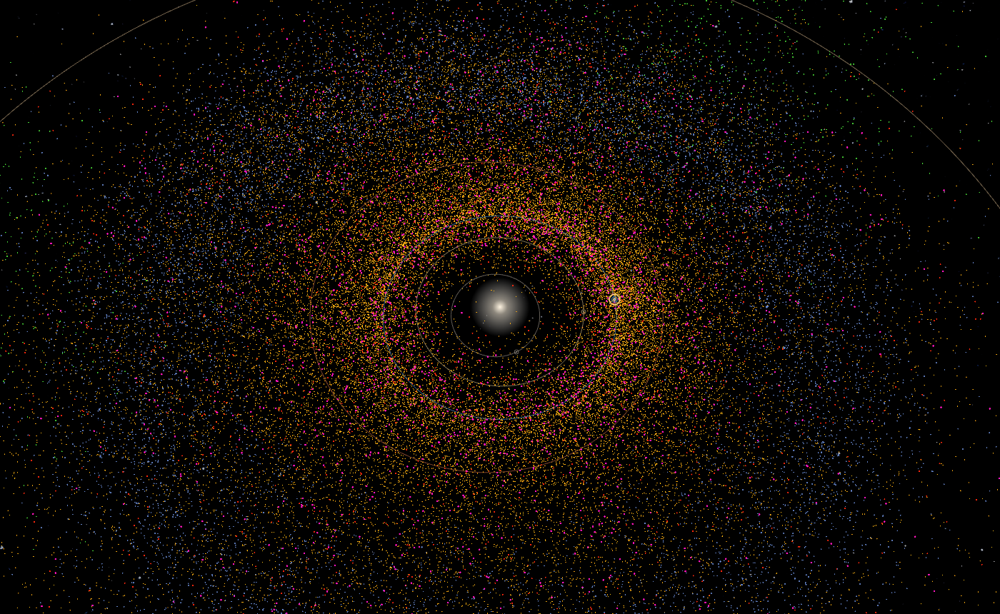
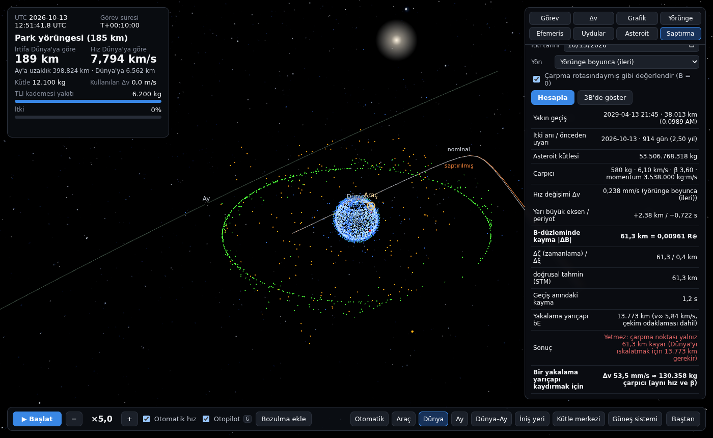
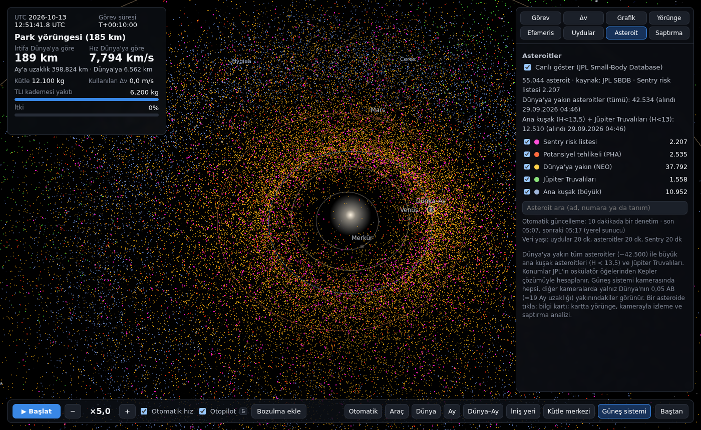
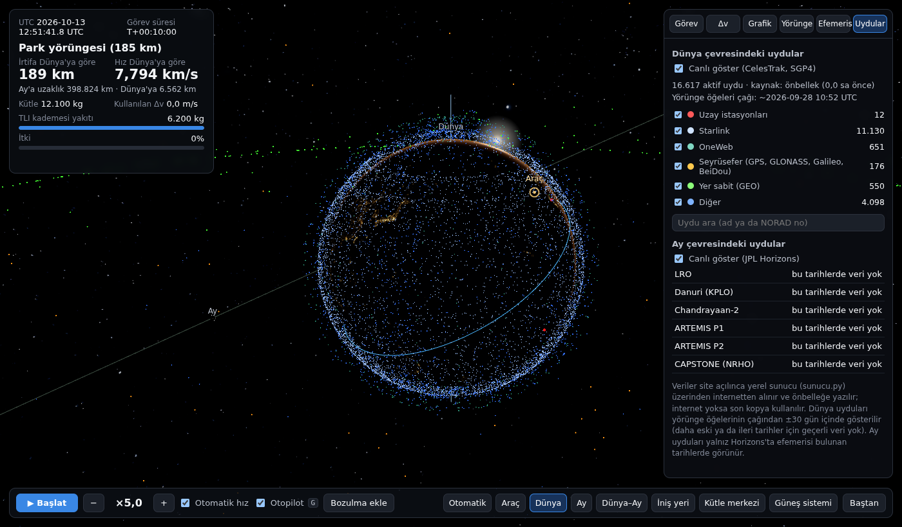
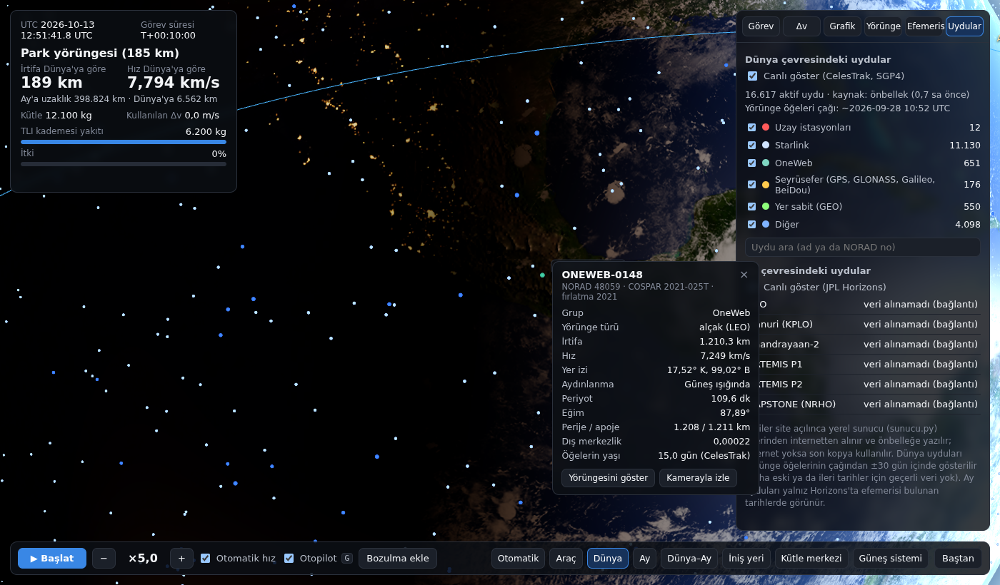

# LS19 · Look Star 19

Tarayıcıda gerçek zamanlı çalışan bir uzay simülasyonu. Dünya park yörüngesinden Apollo 11 iniş bölgesine kadar tüm Ay görevini fizik motoruyla uçurur, Güneş sistemini canlı N-cisim efemerisiyle hesaplar, Dünya ve Ay çevresindeki gerçek uyduları ve ~53.000 asteroidi canlı gösterir. Saptırma laboratuvarında bir asteroide uygulanan itkinin Dünya yakın geçişini ne kadar değiştirdiğini hesaplar.

*A real-time, browser-based space simulator: live N-body ephemeris (DE440-initialised), an Earth-to-Moon mission with LLO/halo/NRHO staging flown by a closed-loop autopilot, ~16,600 live satellites (CelesTrak + SGP4), ~53,000 asteroids (JPL SBDB), and an asteroid-deflection physics engine (kinetic impactor or continuous force, B-plane analysis, validated against JPL close-approach data).*



| | |
|---|---|
|  |  |
|  |  |

## Özellikler

- **Ay görevi:** KSC fırlatma fazlaması, park yörüngesi, TLI, rota düzeltmeleri, LOI ya da halo/NRHO girişi, istasyon tutma, LLO, DOI, motorlu iniş ve temas — otopilotla ya da elle. Dünya park yörüngesi ve Ay bekleme yörüngesi seçilebilir; tasarım her seçim için en az Δv'li yolu kurar.
- **Canlı efemeris:** JPL DE440s ile başlatılan N-cisim entegrasyonu, Ay'ın dönme dinamiği, IAU 2006/2000A Dünya yönelimi.
- **Canlı uydular:** CelesTrak aktif uydular (~16.600), SGP4; Ay çevresinde LRO, Danuri, Chandrayaan-2, ARTEMIS, CAPSTONE (JPL Horizons).
- **Canlı asteroitler:** Dünya'ya yakın tüm asteroitler, büyük ana kuşak asteroitleri ve Jüpiter Truvalıları (JPL SBDB); PHA ve Sentry risk listesi ayrı renkte. Tıklayınca bilgi kartı (çap, albedo, dönme, yörünge, MOID, sonraki yakın geçiş, çarpma olasılığı, keşif), yörünge çizgisi ve yakından kaya modeli. Şekli uzay aracı ya da radarla ölçülmüş 29 asteroitte (Eros, Bennu, Itokawa, Apophis, Vesta, Ceres, Kleopatra, Lutetia, Steins, Toutatis, Geographos, Nereus, Moshup/1999 KW4, 1950 DA…) kaya yerine **gerçek şekil modeli** gösterilir (NASA PDS Küçük Cisimler Düğümü). Bunlara ek olarak [DAMIT](https://damit.cuni.cz/projects/damit/) (ışık eğrisi tersine çevirme, CC BY 4.0) veritabanından **4.369 asteroit** için şekil, gerçek dönme ekseni (λ, β), periyot ve faz yüklenir; model gerçek yönelimiyle döner. Modeller seçilen asteroit için gerekirse ağdan alınır (73 gzip'li parça, toplam ~21 MB, ilk açılışa eklenmez).
- **Saptırma fizik motoru:** asteroit, Güneş + 8 gezegen + Ay + Plüton çekimi (DE440 konumları) ve Güneş'in genel görelilik düzeltmesiyle tümlenir; yakın geçişler bulunur, kaçırma B-düzleminde (Öpik–Valsecchi ξ, ζ) ölçülür. Kinetik çarpıcı (Δv = β·m·U/(M+m)) ya da sürekli kuvvet (N × süre); durum geçiş matrisiyle doğrusal duyarlılık, en etkili itki yönü, önceden uyarı süresi eğrisi, Dünya'yı ıskalatmak için gereken Δv / çarpıcı kütlesi / kuvvet.
- **İki çalışma alanı:** üstteki anahtarla (ya da `M` tuşu) **Ay Görevi** (değiştirilebilir, koşturulabilir fizik motoru, görev saati) ile **Canlı Gökyüzü** (gerçek saat, uydular, asteroitler, saptırma) arasında geçilir; ikisi ayrı saat, ayrı efemeris ve ayrı kamerayla çalışır.
- **Canlı uydu takibi:** gerçek saatte (×1–×3600 hızlandırılabilir) takip listesi; anlık irtifa, hız, yer izi noktası, Güneş/gölge, gözlemciden yükseklik. Yer izi (geçmiş/gelecek) ve kapsama dairesi Dünya üzerinde çizilir.
- **Geçiş tahmini:** gözlemci konumu (şehir listesi ya da tarayıcı konumu) için 3 günlük geçişler: doğuş/en yüksek/batış, yön, çıplak gözle görünürlük (uydu Güneş'te, gökyüzü karanlık), gökyüzü (kutup) çizimi; **Gözlemci** kamerası yerden gökyüzüne bakar ve geçişte uyduyu izler; görünür geçişten 5 dk önce bildirim. Skyfield ile karşılaştırmada zamanlar 1 s, açılar 0,01° içinde.
- **Operatör verisi:** ISS, Starlink, OneWeb, GPS, GLONASS, Planet, Intelsat, SES, Kuiper için CelesTrak Supplemental GP (operatörlerin kendi yörünge çözümleri) normal GP'nin yerine kullanılır.
- **Her uydu 3B model:** Binlerce uydu artık nokta değil, model olarak çizilir. Kameraya en yakın ~1500 uydu `InstancedMesh` ile kendi ailesinin modelini alır (yakında gerçek ölçekte, uzaklaştıkça ekranda ~13 piksel kalacak kadar büyütülür), ötesi nokta kalır. Aileler: Starlink v1/v2 mini, OneWeb, Kuiper, düz panelli megakonstelasyon (Qianfan/Guowang/Hulianwang), Iridium, Globalstar, seyrüsefer (GPS/Galileo/BeiDou/GLONASS), yer eşzamanlı haberleşme, CubeSat, küçük uydu ve genel gövde. Ad ve yörüngeye göre eşleşir (`web/js/satfamilies.js`); modeller Blender'da betikle üretilir (`tools/uydu_aileleri.py`), boyutlar yayımlanmış yaklaşık değerlerdir ve **temsilidir** (bu uyduların kendi 3B modeli yayımlanmamıştır; bilgi kartında "temsili aile modeli" yazar). Yakındaki uydular ana iş parçacığında SGP4 ile kesin konumlandırılır.
- **Gerçek 3B uydu modelleri:** ISS, Hubble, Chandra, Fermi, Swift, TESS, SDO, Terra/Aqua/Aura, GPM, ICESat-2, Landsat 8/9, Sentinel-6A/B, Jason-3, OCO-2, Suomi NPP/NOAA-20/21, GOES-16…19, TDRS, MMS, THEMIS, CYGNSS, GRACE-FO, Hinode, SWAS, SORCE ve Ay'da LRO/ARTEMIS için NASA 3D Resources modelleri (29 model, ~50 uydu); ayrıca ticari GEO uydular (Intelsat, SES, Astra, Eutelsat, EchoStar, Galaxy… ~150 uydu) için SSL-1300 platform modeli (temsili, kartta belirtilir). Gerçek model yalnız kamera uyduya birkaç km yaklaşınca indirilir ve çizilir (aynı anda en fazla 3), uzaklaşınca kaldırılır; bu uydularda aile modeli yerine gerçek model gösterilir. Modeller gerçek ölçekte ve uçuş yönünde (başucu, hız, yörünge normali); Dünya'nın gölgesindeyse kameradan yumuşak dolgu ışığı alır.
- **Gerçekçi gezegen yüzeyleri:** Merkür, Venüs, Mars, Jüpiter, Satürn, Uranüs, Neptün ve Plüton gerçek dokularla çizilir (yaklaşınca indirilir, ~4 MB toplam). IAU dönme parametreleriyle (kutup, başlangıç meridyeni, dönme hızı) dokudaki özellikler gerçek yerinde ve dönerek görünür; kayalık gezegenlerde dokunun parlaklığından kabartma ve doku çözünürlüğü aşıldığında ince yüzey ayrıntısı, gaz devlerinde kenar kararması, terminatör ve atmosfer ışıması (Venüs sarı bulut kabuğu, Mars tozlu, Uranüs/Neptün mavi, Plüton'un mavi sisi) bulunur. Satürn'ün halkası gerçek yarıçap profili dokusuyla çizilir; halka gezegene, gezegen de halkaya gölge düşürür.
- **2B yükselti haritası:** üstteki **Yükselti** düğmesi Dünya (NOAA ETOPO 2022: kara yüzeyi ve deniz tabanı) ve Ay (LRO/LOLA) için renk basamaklı, kabartma gölgeli düz harita açar; fareyle enlem/boylam/yükseklik okunur, tekerlekle yakınlaşılır, sürüklenerek kaydırılır. Güneş altı noktası, Ay altı/Dünya altı nokta, gözlemci, seçili uydunun yer izi noktası ve Apollo 11 iniş yeri işaretlenir.
- **Yakın plan yüzey ayrıntısı:** Dünya (kara, bulut kenarı) ve Ay'da kamera doku çözünürlüğünü (Dünya 4,9 km/px, Ay 1,06 km/px) aşacak kadar yaklaşınca gürültü tabanlı ince ayrıntı (kara/regolit tanesi, küçük kabartma) devreye girer.
- **Sade alt çubuk:** ana düğmeler (oynat, hız, şimdi) görünür; kamera, zaman hızı/atlama ve uçuş seçenekleri açılır ağaç menülerde (katlanabilir gruplar, klavyeyle gezilebilir, seçili değer düğmede yazar).
- **Otomatik güncelleme:** 10 dakikada bir sürüm denetimi; değişen veri sayfa yenilenmeden yüklenir. Kaynak kurallarına uyulur (CelesTrak en sık 2 saatte bir, JPL SBDB/Sentry günlük).

### Doğrulama

| Sınama | Sonuç |
|---|---|
| Apophis, 13 Nisan 2029 yakın geçişi | 38.013 km — JPL CAD 38.011,5 km (fark ~2 km, zaman farkı < 1 s) |
| 1 cm/s itki: doğrusal (STM) ve tam tümleme | Δζ 2276,6 / 2276,5 km |
| DART/Dimorphos | başa baş Δv 2,99 mm/s; ölçülen 2,70 mm/s → periyot −32,8 dk (gözlenen −33,0 ± 1,0 dk) |
| ISS geçişleri, İstanbul (3 gün) | Skyfield'a göre en büyük fark 0,6 s ve 0,007° |
| Ay görevi profilleri (13 Ekim 2026) | Apollo 5937,8 m/s · NRHO 9:2 6686,1 m/s · L1 6499,2 · L2 7025,1 — hepsi temasla biter |

## Çalıştırma (yerel)

Gereken: Python 3 (yalnız standart kütüphane) ve güncel bir tarayıcı.

```bash
cd web
python3 sunucu.py          # macOS'ta baslat.command'a çift tıklamak da olur
# tarayıcıda: http://localhost:8765
```

`sunucu.py` sitenin dosyalarını sunar; CelesTrak (GP ve Supplemental GP), JPL Horizons, JPL SBDB ve Sentry için yerel vekil, önbellek ve 10 dakikalık arka plan güncellemesi görevi görür. Ayrıntılar: [web/BENIOKU.md](web/BENIOKU.md).

## Vercel'de yayınlama

Depo Vercel'e olduğu gibi bağlanabilir; ayar gerekmez (`vercel.json` hazır):

1. Vercel → **Add New… → Project** → GitHub'dan `LS19` deposunu seç → **Deploy**.
2. Site `web/` klasöründen statik olarak sunulur; canlı veri vekili `api/` klasöründeki sunucusuz işlevlerdir (`/api/gp`, `/api/asteroids`, `/api/sbdb`, `/api/sentry`, `/api/horizons`, `/api/surum`).

Notlar:

- **Blender dosyası sorun olmaz:** `ROCSIM.blend` depoda yoktur (GitHub sınırını aşar, `.gitignore`); `scripts/` içindeki Blender betikleri ve `kernels/`, `pylib/` gibi klasörler `.vercelignore` ile yayına alınmaz.
- **Güncelleme bulutta:** Hobby planında cron en sık günde bir çalışabildiği için zamanlayıcı kullanılmaz. Tarayıcı 10 dakikada bir `/api/surum`'u sorar; veri istekleri kaynağın izinli aralığına göre bir sürüm anahtarı taşır ve Vercel CDN yanıtı o süre boyunca paylaşımlı önbellekte tutar. Böylece ziyaretçi sayısından bağımsız olarak CelesTrak'a 2 saatte, JPL'e günde CDN bölgesi başına bir istek gider.
- **Boyut:** Sayfa ilk açılışta ~90 MB indirir (JPL çekirdekleri ve 8k dokular; sonra tarayıcı önbelleğinde). Hobby planının aylık 100 GB aktarımı yaklaşık 1.000 ilk ziyarete yeter.
- **CelesTrak ve bulut:** CelesTrak Vercel'in IP'lerini engelleyebiliyor (403). Tarayıcı bu durumda GP verisini CelesTrak'tan doğrudan alır (CORS açık, 2 saat tarayıcı önbelleği). Supplemental GP'de CORS olmadığından bulutta ek bir kopya gerekir: `docs/celestrak-data.yml` iş akışı 2 saatte bir CelesTrak'tan GP ve Supplemental GP'yi çekip deponun `data` dalına (geçmişsiz) yazar; bulut işlevleri ve tarayıcı CelesTrak'a ulaşamazsa bu kopyayı kullanır. Etkinleştirmek için dosyayı GitHub'da `.github/workflows/` altına taşıyın (Actions açık olmalı). `data` dalı Vercel'de yayına alınmaz (`vercel.json` → `git.deploymentEnabled`).

## Testler (Node 20+)

```bash
cd web
node test/test_deflect.js      # Apophis 2029 (JPL CAD ile), STM/tam tümleme uyumu, DART
node test/test_api.js          # bulut işlevleri (taklit veriyle), yerel sunucuyla aynı biçim, GitHub kopyasına düşme
node test/test_passes.js       # ISS geçişleri, Skyfield sonuçlarıyla
node test/test_satmodels.js    # 3B model kataloğu (NORAD/ad eşleşmeleri, dosyalar)
node test/test_satfamilies.js  # uydu aileleri (ad/yörünge eşleşmesi, aile GLB'leri)
node test/test_astshapes.js    # asteroit şekil modelleri (katalog, birim yarıçap, bilinen boyutlar)
node test/test_damit.js        # DAMIT paketi: 4.369 kaydın bütünlüğü, hacim, dönme verisi
node test/test_elevation.js    # Dünya yükselti verisi (ETOPO): çözme ve bilinen noktalar
node test/test_cr3bp.js        # halo/NRHO aileleri
node test/test_profiles.js     # tüm görev profillerini tasarlayıp uçurur (birkaç dakika)
```

## Klasörler

| Yol | İçerik |
|---|---|
| `web/` | Tarayıcı simülasyonu (Three.js, Web Worker'lar), `sunucu.py`, testler |
| `web/js/` | `engine.js` fizik · `ephem.js`/`live.js` efemeris · `cr3bp.js`/`halo.js` halo yörüngeleri · `design.js` görev tasarımı · `mission.js` otopilot · `sats.js`/`satlayer.js` uydular · `asteroids.js`/`astwork.js` asteroitler · `deflect.js`/`deflectwork.js`/`astui.js` saptırma · `passes.js`/`tracker.js`/`skyui.js` canlı takip ve geçişler · `satcatalog.js`/`satmodels.js` 3B uydu modelleri · `treemenu.js` alt çubuk menüleri · `updater.js` güncelleme · `scene.js`/`ui.js` görüntü ve arayüz |
| `web/models/sats/` | NASA 3D Resources uydu modelleri (meshopt + WebP ile küçültülmüş GLB; `tools/uydu_modelleri.mjs` ile yeniden üretilir) |
| `web/models/fam/` | Uydu aileleri: Blender'da üretilen düşük poligonlu GLB'ler (`tools/uydu_aileleri.py`; köşe renkli, aile başına ~10–25 kB) |
| `web/models/ast/` | Gerçek asteroit şekil modelleri (NASA PDS OBJ → ~8 bin üçgen GLB, hacim eşdeğeri yarıçap 1) ve `katalog.json`; `tools/asteroit_modelleri.py` ile üretilir · `damit/`: DAMIT şekilleri (≤ 800 üçgen, int16, gzip'li parçalar) ve `damit.json` indeksi; `tools/damit_paketle.py` ile üretilir |
| `api/` | Vercel sunucusuz işlevleri (canlı veri vekili) |
| `scripts/` | Blender sürümü (Adım 1–5): görev motoru ve sahne betikleri |
| `kernels/` | JPL DE440s, Ay yönelim çekirdeği, efemeris tablosu |

## Veri kaynakları ve lisanslar

- Kod: MIT (bkz. [LICENSE](LICENSE)).
- JPL DE440s ve Ay yönelim çekirdekleri: NASA/JPL NAIF.
- Canlı veri: [CelesTrak](https://celestrak.org) GP, [JPL Horizons](https://ssd.jpl.nasa.gov/horizons/), [JPL Small-Body Database](https://ssd.jpl.nasa.gov/tools/sbdb_query.html), [JPL Sentry](https://cneos.jpl.nasa.gov/sentry/), JPL CAD.
- Asteroit şekil modelleri: [NASA PDS Küçük Cisimler Düğümü](https://sbn.psi.edu/pds/shape-models/) (kamu malı): JPL radar modelleri (Hudson, Lawrence, Brozović, Busch vd.), NEAR (Eros) ve Hayabusa (Itokawa) için Gaskell, Dawn (Vesta, Ceres), Rosetta OSIRIS (Lutetia, Steins), Bennu radar modeli (Nolan vd. 2021). Sadeleştirilmiş ve birim yarıçapa ölçeklenmiştir; her modelin kaynağı `web/models/ast/katalog.json`'dadır.
- DAMIT asteroit şekilleri ve dönme parametreleri: [DAMIT](https://damit.cuni.cz/projects/damit/), Creative Commons Attribution 4.0 — Ďurech, J., Sidorin, V., Kaasalainen, M. 2010, A&A 513, A46; her model kendi yayınına dayanır (DAMIT'te listelenir). Sadeleştirilmiş, nicemlenmiş ve parçalara bölünmüştür.
- Uydu aile modelleri (`web/models/fam/`): bu projede Blender betiğiyle üretildi (MIT, kod ile aynı); Starlink, OneWeb vb. için yayımlanmış yaklaşık boyutlara dayanan temsili modellerdir, resmî CAD değildir.
- Uydu modelleri: [NASA 3D Resources](https://github.com/nasa/NASA-3D-Resources) (NASA, kamu malı; NASA logosu/amblemi kullanım kurallarına tabidir). Kopuk parçalar temizlendi, ağlar sadeleştirildi, dokular WebP'ye çevrildi.
- Dünya yükseltisi: [NOAA NCEI ETOPO 2022](https://www.ncei.noaa.gov/products/etopo-global-relief-model) (kamu malı; 60 arc-saniye, 5 örnekte bir, 0,125° ızgaraya alan ortalamasıyla indirildi); Ay yükseltisi: NASA LRO/LOLA.
- Gezegen dokuları: [Solar System Scope](https://www.solarsystemscope.com/textures/) (CC BY 4.0; Merkür, Venüs bulut tepesi, Mars, Jüpiter, Satürn ve halkaları, Uranüs, Neptün); Plüton: NASA/JHUAPL/SwRI New Horizons genişletilmiş renk haritası (PIA19956, kamu malı); Ay rengi ve yükseklik: NASA SVS CGI Moon Kit (LROC/LOLA).
- Kütüphaneler: [three.js](https://threejs.org) (MIT), [satellite.js](https://github.com/shashwatak/satellite-js) (MIT), jplephem (MIT).
